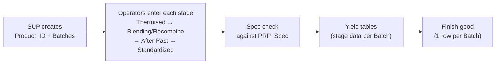
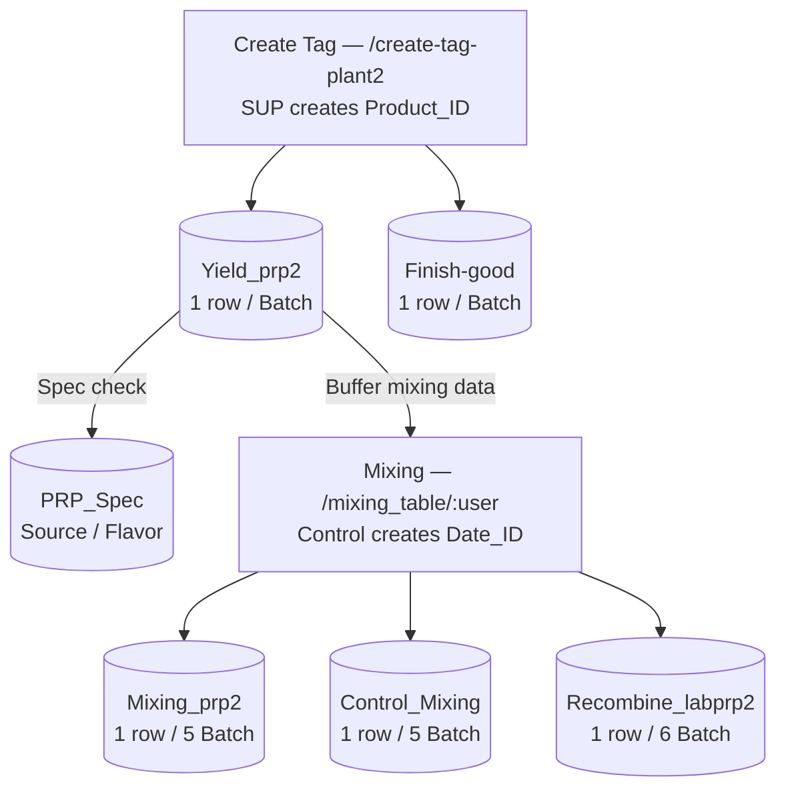

# PRP — Dairy Mixing and Quality Control

A Budibase application that replaces the paper production records of the dairy mixing
buildings (**PRP1**, **PRP2** and **PRP3**) with a database. Supervisors and operators enter each
production stage on a tablet; every record is tied to one `Product_ID`, so a product can be
traced from the first mixing step to the finished carton.

> New here? Read this page first, then the overview of the building you care about:
> **[PRP1](prp1/readme.md)** · **[PRP2](prp2/readme.md)** · **[PRP3](prp3/readme.md)**

---

## Why it exists

Production data used to live on paper forms. That meant:

- high paper use, and records scattered across many documents
- slow look-ups of historical data and slow verification
- no easy way to reuse or consolidate the data for analysis

PRP stores the same records digitally, so they can be searched, checked against spec
automatically, and reused downstream. It is part of the plant's move from paper to a
central digital database — the first step towards the wider Smart Factory platform.

## Buildings and products

| Building | Products | Docs |
|---|---|---|
| **PRP1** (Production Building 1) | Fresh Milk, Fermented Milk (Recombine area) · Soy Milk (Blending area) | [prp1/](prp1/readme.md) |
| **PRP2** (Production Building 2) | Fermented Milk. Also sends Fresh Milk and Fermented Milk on to PRP1 and PRP3. Six Groups: F, G, H, I, J, K | [prp2/](prp2/readme.md) |
| **PRP3** (Production Building 3) | Fresh Milk, Fermented Milk, Soy Milk, Tea, Coffee, Juice | [prp3/](prp3/readme.md) |

## Who uses it

| Role | What they do |
|---|---|
| **SUP** (supervisor) | Creates the `Product_ID` (and Batches), enters BOM / buffer data, edits and adds/removes Batches, signs off the Standardized stage |
| **Operator** | Enters the measured values for each Batch at each stage. Their employee ID can be saved only once per record |
| **Control** (PRP2) | Creates the `Date_ID` for Mixing, and enters Buffer, Mixing and Recombine control data |
| **Lab** (PRP2) | Enters lab results for Buffer, Starter and Recombine. Cannot change Batch numbers |

## How it works — end to end



1. **SUP creates the `Product_ID`** on the Create Tag page. The system writes it to every table
   that will need it, and generates the Finish-good rows automatically.
2. **Operators fill in each production stage** for every Batch. Pages differ slightly by product
   (e.g. *After Past* is called *After cooling* for Tea and Soy Milk).
3. **Every value is checked against `PRP_Spec`**, looked up by milk source, flavor and batch size.
4. **Stage data lands in the Yield tables**; the Standardized stage also calculates BOM volume and
   buffer volume.
5. **Finish-good** holds the after-sterilization check for each Batch.

### PRP2 differs

PRP2 follows the same idea (Create Tag → stage data → spec check → Finish-good) but is organised
around **Buffer, Mixing and Recombine** instead of the PRP1/PRP3 stage pages:



- Batches in one run can alternate between products (e.g. Batch 1–2 = A, Batch 3–4 = B), so the
  spec check reads the **Flavor of the Batch on screen**, not one Flavor for the whole run.
- Lab and Control each have their own pages; some values entered by Lab are shown to Control as
  grey, read-only fields.
- Mixing is identified by a `Date_ID` (production date + shift) created by Control.

## `Product_ID` — the thread through everything

`Product_ID` identifies one production run (date, week, day, loop and group) and is stored in
**every** PRP table. Searching by `Product_ID` pulls up the whole history of that product.

```
260106-41Tu1-A
│      │ │ │ └─ Group (machine group)
│      │ │ └─── Loop (production loop)
│      │ └───── Day of week (Su Mo Tu We Th Fr Sa)
│      └─────── Week
└────────────── Date
```

How and *when* it is created differs by building — see
[PRP3 → Product_ID](prp3/prp3-table.md#product_id),
[PRP1 Soy Milk → Product_ID](prp1/soy-milk.md#4-product_id-created-at-standardized) and
[PRP2 → Create Tag](prp2/create-tag-plant2.md).

PRP2 uses the same format; its Groups are F, G, H, I, J and K.

## Manual vs automatic

| Entered by people | Generated by the system |
|---|---|
| `Product_ID` inputs (date, week, loop, group, flavors, batches) | `Product_ID` string itself |
| BOM and buffer inputs | BOM volume and `buffer_vol` totals |
| Measured values at every stage | Soy Milk Batch rows (incl. split batches) — automation **Generate Product Batches** |
| Operator employee ID | Finish-good rows — automation **SaveBatch** |
| PRP2: `Date_ID` and Mixing Batches | PRP2 rows — automations **SaveYieldPrp2Batch** (`Yield_prp2`) and **SaveBatch -Finish-goodprp2** (`Finish-good`) |

## Tables at a glance

| Table | Used by | Holds | Layout |
|---|---|---|---|
| `Prp 3 table` | PRP3, PRP1 Fresh Milk | `Product_ID`, Flavor, Batch, Size per run | Columns (8 Batches) |
| `Yield` | PRP3, PRP1 Fresh Milk | Stage data for Fresh/Demol Milk, Soy Milk, Tea | Columns (8 Batches) |
| `Yield2` | PRP3 | Stage data for Fermented Milk (added because `Yield` was full) | Columns |
| `prp1_table` | PRP1 Soy Milk | `Product_Date`, Batch, Group, `Product_ID`, stage data | **Rows** (1 Batch = 1 row) |
| `prp1thermised`, `blendingprp1`, `buffer1_prp1`, `buffer2_prp1` | PRP1 Fresh Milk | One table per stage page | Columns |
| `prp_2_table` | PRP2 | `Product_ID`, Flavor, Batch, Size per run | **Columns** (11 Batches in 1 row) |
| `Yield_prp2` | PRP2 | Production data, Buffer Lab and Buffer Control | **Rows** (1 Batch = 1 row) |
| `Mixing_prp2` | PRP2 | Mixing Batches and Lab Mixing data | Columns (5 Batches in 1 row) |
| `Control_Mixing` | PRP2 | Control Mixing data (Pectin, Liquid Sugar, Citric) | Columns (5 Batches in 1 row) |
| `Recombine_labprp2` | PRP2 | Lab and Control data of Recombine milk | Columns (6 Batches in 1 row) |
| `Finish-good` | **all plants** | After-sterilization check per Batch | **Rows** — [details](prp3/finish-good.md) |
| `PRP_Spec` | all pages | Spec limits by Source + Flavor + Size | Lookup — [details](prp3/yield.md#spec-check-checkspecprp) |

> **Why PRP2 mixes layouts:** `prp_2_table` is column-based so the overview shows one row per
> `Product_ID` with all its Batches. `Yield_prp2` and `Finish-good` hold much more data per
> Batch, so they are row-based — 11 Batches as columns would fill the table and be hard to edit.

## Documentation map

```
docs/prp/
├── README.md              ← you are here
├── prp1/
│   ├── README.md          PRP1 overview
│   ├── soy-milk.md        Soy Milk: batches, Product_Date, pages, Product_ID
│   ├── fresh-milk.md      Fresh & Fermented Milk: tables and pages
│   └── problems.md        Known issues and improvement ideas
├── prp2/
│   ├── README.md          PRP2 overview
│   ├── create-tag-plant2.md   Create Tag: Product_ID, prp_2_table, SaveYieldPrp2Batch
│   ├── buffer_labprp2.md  Buffer Lab page: spec check by Flavor, batch buttons
│   ├── buffer_prp2.md     Buffer Control page: Total Amount, lab-pulled fields
│   ├── mixing_prp2.md     Mixing pages: Date_ID, Mixing_prp2, Control_Mixing
│   └── recombined_prp2.md Recombine pages (Control and Lab)
└── prp3/
    ├── README.md          PRP3 overview
    ├── prp3-table.md      Prp 3 table + Create Tag page
    ├── yield.md           Stage pages, spec check, BOM / buffer formulas
    ├── finish-good.md     Finish-good table + SaveBatch automation (shared by all plants)
    └── problems.md        Known issues and improvement ideas
```
