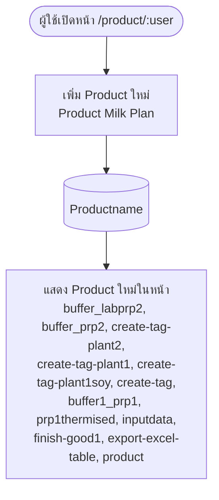

# product (`/product/:user`)

หน้าสำหรับ **เพิ่ม Product ใหม่** โดยเก็บ **Product Milk Plan** ลงตาราง `Productname`

## 1. ตารางที่ใช้

| ตาราง | เก็บข้อมูล |
|---|---|
| `Productname` | Product Milk Plan (รายชื่อ Product ที่เพิ่มเข้าระบบ) |

## 2. หน้าที่แสดง Product ใหม่

เมื่อผู้ใช้งานเพิ่ม Product ใหม่ จะแสดงที่หน้าต่อไปนี้

| # | หน้า |
|---|---|
| 1 | `buffer_labprp2` |
| 2 | `buffer_prp2` |
| 3 | `create-tag-plant2` |
| 4 | `create-tag-plant1` |
| 5 | `create-tag-plant1soy` |
| 6 | `create-tag` |
| 7 | `buffer1_prp1` |
| 8 | `prp1thermised` |
| 9 | `inputdata` |
| 10 | `finish-good1` |
| 11 | `export-excel-table` |
| 12 | `product` |

## 3. Workflow

