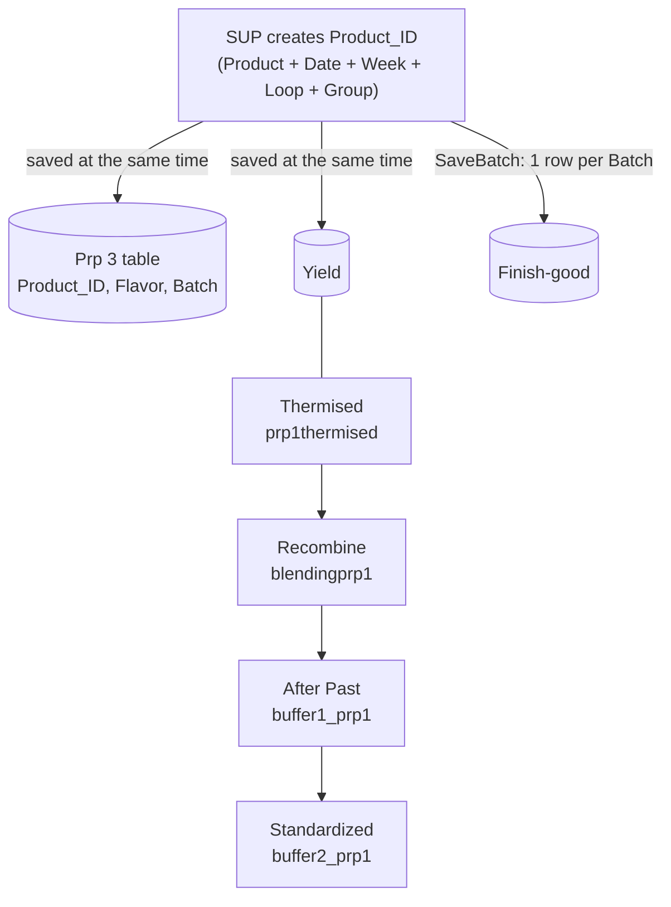

# PRP1 — Fresh Milk and Fermented Milk

[← PRP1 overview](README.md)

PRP1 Fresh Milk follows the **same process as PRP3**, so it reuses `Prp 3 table`, `Yield`,
`Finish-good` and `PRP_Spec`. The differences are in the stage pages, which each have their own
PRP1 table.

## Flow

The `Product_ID` is **written to all three tables when it is created** — it is not copied from
`Prp 3 table` to the others later. Finish-good gets it from creation too, not from the stage pages.

## Tables

| Table | Layout | Holds |
|---|---|---|
| `Prp 3 table` | Columns, up to 8 Batches | `Product_ID`, Flavor, Batch |
| `Yield` | Columns, up to 8 Batches | Stage data across the 4 pages below |
| `Finish-good` | Rows | After-sterilization check — [details](../prp3/finish-good.md) |
| `PRP_Spec` | Lookup | Spec limits by Source + Flavor + Size — [details](../prp3/yield.md#spec-check-checkspecprp) |

## Stage pages

Each page shows up to **8 Batches** and stores its data in its own table, referenced by
`Product_ID`. (The table names say where each page saves — data is not passed from one table to
the next.)

| Stage | Table | Difference from PRP3 |
|---|---|---|
| **Thermised** | `prp1thermised` | Checks **pH**, has a **water pH** pop-up; **no** Sediment or Water Add fields |
| **Recombine** | `blendingprp1` | Enter and verify up to 8 Batches on one page |
| **After Past** | `buffer1_prp1` | Adds an **SNF** check |
| **Standardized** | `buffer2_prp1` | SUP verifies the data; `BOM_Volume` and `Buffer_Volume` are calculated automatically ([formulas](../prp3/yield.md#bom-and-buffer_vol-formulas)) |

Every page validates against `PRP_Spec`.
