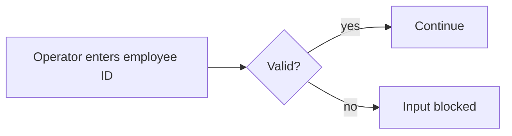

# PRP1 — Known issues and improvements

[← PRP1 overview](README.md)

| # | Topic | Status |
|---|---|---|
| 1 | Adding new products | Open — same issue as PRP3 |
| 2 | Soy Milk Storage / Blending batch split | Open |
| 3 | Overall Finish-good view | ✅ Done |
| 4 | Operator employee-ID validation | ✅ Done |

## 1. Adding new products

Fresh Milk uses the PRP3 process, so it inherits PRP3's problem: each product needs different
data and stages, and the current design may need new pages for every new product. See
[PRP3 problems → adding new products](../prp3/problems.md#2-adding-new-products).

## 2. Soy Milk Storage and Blending

In the real process, **Storage and Blending work on whole Batches** — they shouldn't be split.
The system splits Batch numbers from the very first step, so operators **enter the same data
twice** (once per sub-batch).

**Proposal:** separate the Storage and Blending steps and redesign their pages to match the real
process. This would:

- remove duplicate data entry
- make Batch numbers less confusing
- line the pages up with how production actually works
- reduce entry errors

## 3. Overall Finish-good view — done

Users needed one place to see all Finish-good data. A **Finish-good table view** now shows it on a
single page:

| Product | Batch | Group | Status |
|---|---|---|---|
| … | … | … | … |

## 4. Operator employee-ID validation — done

To stop badly formatted entries, the employee-ID field is now validated:

| Rule | |
|---|---|
| Length | **6 characters** |
| Emoji | Not allowed |
| Anything else that doesn't match | Blocked |

