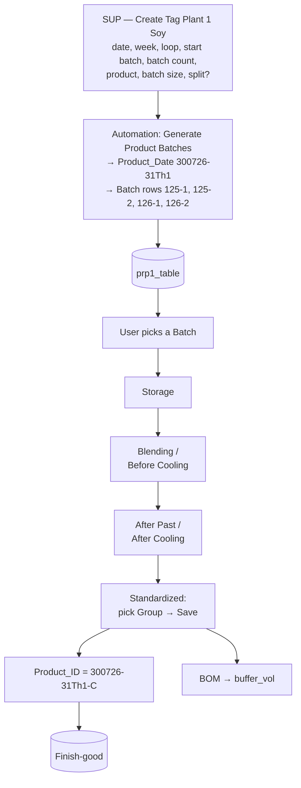

# PRP1 — Soy Milk

[← PRP1 overview](README.md)

Soy Milk is recorded in **`prp1_table`**, one row per Batch. Two things make it different from
Fresh Milk:

1. **Batches are generated automatically** (including split batches) by the
   *Generate Product Batches* automation.
2. **The `Product_ID` is created late**, at the Standardized stage — because a Batch can still
   change Group during production.

- [1. Overall flow](#1-overall-flow)
- [2. Product_Date](#2-product_date)
- [3. Batches](#3-batches)
- [4. Product_ID (created at Standardized)](#4-product_id-created-at-standardized)
- [5. Stage pages](#5-stage-pages)
- [6. prp1_table, step by step](#6-prp1_table-step-by-step)

## 1. Overall flow



Every stage page validates its values against `PRP_Spec` (Source, Flavor, Size —
[details](../prp3/yield.md#spec-check-checkspecprp)).

## 2. Product_Date

The SUP starts a run on **Create Tag Plant 1 Soy** with:

| Field | Meaning |
|---|---|
| Product Date | Production date |
| Week | Production week |
| Loop | Production loop |
| Start Batch | First main Batch number |
| Batch Count | Number of **main** Batches |
| Product | Product |
| Batch Size | Batch size |

From the date, week, day and loop the system builds the **Product_Date** code:

```
300726-31Th1
│     │ │ └─ Loop 1
│     │ └─── Day: Thursday (Su Mo Tu We Th Fr Sa)
│     └───── Week 31
└─────────── 30 Jul 2026 (DDMMYY)
```

*Example input: Product Date = 7/30/2026, Week = 31, Loop = 1.*

> No Group and no `Product_ID` yet — the Batch may still change Group (see [section 4](#4-product_id-created-at-standardized)).

## 3. Batches

A **Batch** is the production unit tracked through PRP1. Each Batch is **one row** in `prp1_table`.

### Normal vs split

| Type | Rows created for main Batch 125 |
|---|---|
| Normal | `125` |
| Split | `125-1`, `125-2` (main Batch 125, parts 1 and 2) |

### Batch Count = main Batches, not rows

| Start Batch | Batch Count | Split | Rows created |
|---|---|---|---|
| 125 | 1 | No | `125` |
| 125 | 2 | No | `125`, `126` |
| 125 | 2 | Yes | `125-1`, `125-2`, `126-1`, `126-2` → **4 rows** |

The Product and Batch Size apply to every Batch created from the same Product_Date:

| Product_Date | Batch | Product | Batch Size |
|---|---|---|---|
| 300726-31Th1 | 125-1 | Soy Milk | 30 |
| 300726-31Th1 | 125-2 | Soy Milk | 30 |
| 300726-31Th1 | 126-1 | Soy Milk | 30 |
| 300726-31Th1 | 126-2 | Soy Milk | 30 |

### What *Generate Product Batches* does

1. Takes the SUP's inputs
2. Builds the Product_Date
3. Generates the main Batches, and splits them if requested
4. Creates one row per Batch with Product_Date, Product and Batch Size
5. Saves the rows to `prp1_table`

It does **not** create the `Product_ID` — the Group isn't known yet.

### Why rows

One row per Batch means 13 Batches are simply 13 rows — no new columns, split batches fit
naturally, queries are simpler, and the table can grow without schema changes.

## 4. Product_ID (created at Standardized)

On the **Standardized** page the user must **pick the Group and press Save first**; only then do
the remaining fields appear. That Save:

- builds the final `Product_ID` = **`[Product_Date]-[Group]`**
- adds the `Product_ID` to **Finish-good**

| Product_Date | Group | Product_ID |
|---|---|---|
| 300726-31Th1 | C | **300726-31Th1-C** |

**Batch** and **Product_ID** are separate: the Batch identifies the production unit
(`125-1`), the `Product_ID` identifies the product by date and Group.

## 5. Stage pages

The user first **selects a Batch** from the list, then opens its pages. A **Step condition** on
each row controls which page is available next, so stages are filled in order:

| # | Stage | Notes |
|---|---|---|
| 1 | Storage | |
| 2 | Blending / Before Cooling | |
| 3 | After Past / After Cooling | |
| 4 | Standardized | Pick Group → Save → fields appear · `buffer_vol` calculated from BOM ([formulas](../prp3/yield.md#bom-and-buffer_vol-formulas)) |

> ⚠️ **To verify:** the two original docs name stages 2 and 3 differently — *Blending / After Past*
> in one, *Before Cooling / After Cooling* in the other. Check the labels in the live app.

## 6. `prp1_table`, step by step

**After Generate Product Batches** — Group and `Product_ID` are empty:

| Product_Date | Batch | Product | Batch Size | Group | Product_ID |
|---|---|---|---|---|---|
| 300726-31Th1 | 125-1 | Soy Milk | 30 | – | – |
| 300726-31Th1 | 125-2 | Soy Milk | 30 | – | – |
| 300726-31Th1 | 126-1 | Soy Milk | 30 | – | – |
| 300726-31Th1 | 126-2 | Soy Milk | 30 | – | – |

**After Standardized is saved with Group C** (for Batch 125-1):

| Product_Date | Batch | Product | Batch Size | Group | Product_ID |
|---|---|---|---|---|---|
| 300726-31Th1 | 125-1 | Soy Milk | 30 | C | 300726-31Th1-C |

Finished-product data goes to the shared [`Finish-good`](../prp3/finish-good.md) table.
