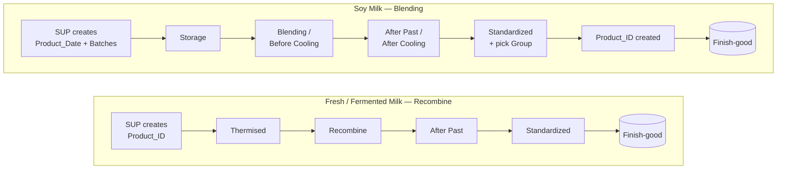

# PRP1 — Overview

[← PRP overview](../README.md)

**PRP1 is Production Building 1.** It makes three products in two areas:

| Area | Products | Docs |
|---|---|---|
| **Recombine** | Fresh Milk, Fermented Milk | [fresh-milk.md](fresh-milk.md) |
| **Blending** | Soy Milk | [soy-milk.md](soy-milk.md) |

The two areas work differently. Fresh Milk follows the **same process as PRP3** and shares its
tables; Soy Milk has its own **row-based** table and creates its `Product_ID` late.

## Workflows

| | Fresh / Fermented Milk | Soy Milk |
|---|---|---|
| `Product_ID` created | At the start, by the SUP | At **Standardized**, once the Group is chosen |
| Main table | `Prp 3 table` (shared with PRP3) | `prp1_table` |
| Layout | Columns, up to 8 Batches | **Rows** — 1 Batch = 1 row |
| Stage tables | `prp1thermised`, `blendingprp1`, `buffer1_prp1`, `buffer2_prp1` | all in `prp1_table` |
| Batches created by | SUP | Automation **Generate Product Batches** |

## Manual vs automatic

| Who | Enters |
|---|---|
| **SUP** | `Product_ID` / Product_Date and run data · BOM and buffer inputs |
| **Operator** | Measured values at every stage (Storage, Blending, Thermised, Recombine, After Past, Standardized) |

| Automation | Does |
|---|---|
| **Generate Product Batches** | Creates the Soy Milk Batch rows (including split batches) so the SUP doesn't add them one by one |
| **SaveBatch** | Creates the Finish-good rows from the produced Batches — [details](../prp3/finish-good.md) |
| BOM / `buffer_vol` | Calculated from SUP inputs on the Standardized page — [formulas](../prp3/yield.md#bom-and-buffer_vol-formulas) |

## Tables

| Table | Holds |
|---|---|
| `Prp 3 table` | Fresh Milk `Product_ID`, Flavor, Batch — [details](../prp3/prp3-table.md) |
| `prp1_table` | Soy Milk Product_Date, Batch, Group, `Product_ID` and stage data |
| `Yield` + stage tables | Fresh Milk data at each stage |
| `Finish-good` | After-sterilization check, shared by all plants — [details](../prp3/finish-good.md) |
| `PRP_Spec` | Spec limits by Source + Flavor + Size — [details](../prp3/yield.md#spec-check-checkspecprp) |

## Pages in this folder

| Page | Covers |
|---|---|
| [soy-milk.md](soy-milk.md) | Product_Date, Batch generation and splitting, stage pages, late `Product_ID` |
| [fresh-milk.md](fresh-milk.md) | Fresh & Fermented Milk tables and stage pages, and how they differ from PRP3 |
| [problems.md](problems.md) | Known issues and improvements |
