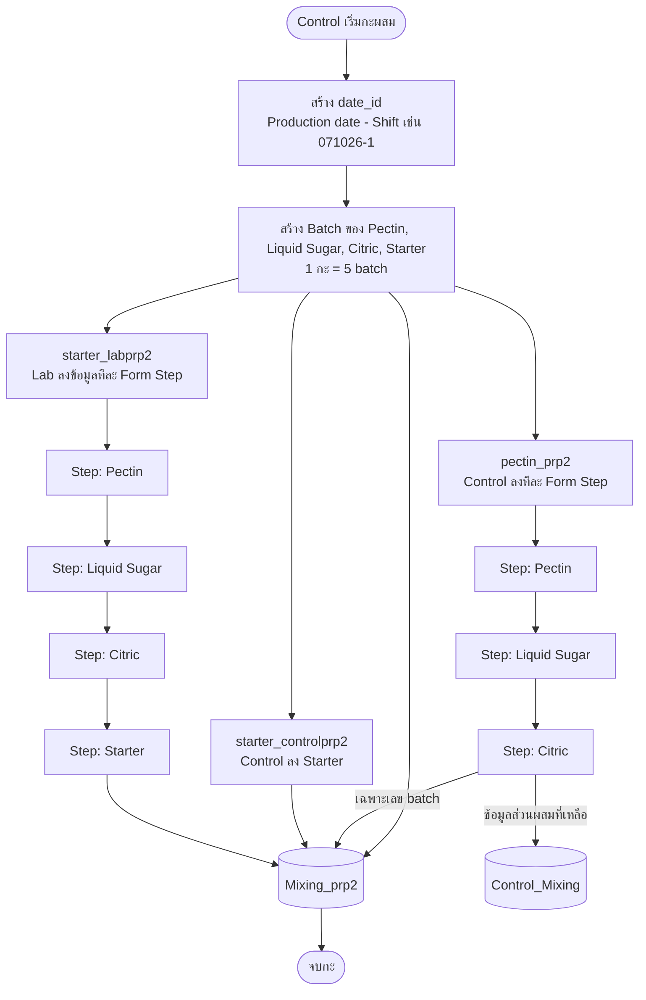

# Mixing PRP2

กลุ่มหน้าลงข้อมูล **ส่วนผสม (Mixing)** ของ PRP2 ประกอบด้วย 3 หน้า

| หน้า | ผู้ใช้งาน | ข้อมูลที่ลง |
|---|---|---|
| `starter_labprp2` | Sup, Lab | ข้อมูล Lab ของ Pectin, Liquid Sugar, Citric, Starter |
| `starter_controlprp2` | Sup, Control | ข้อมูล Control ของ Starter |
| `pectin_prp2` | Sup, Control | ข้อมูล Control ของ Pectin, Liquid Sugar, Citric |

## 1. การสร้าง date_id และ Batch

**Control** เป็นผู้สร้าง `date_id` และสร้าง Batch ของ Pectin, Liquid Sugar, Citric, Starter ตามที่ผสมในกะนั้น

**รูปแบบ date_id:** `{Production date}-{Shift}`

| Shift | ความหมาย |
|---|---|
| 1 | กะเช้า |
| 2 | กะบ่าย |
| 3 | กะดึก |

ตัวอย่าง: `071026-1` = วันที่ผลิต 071026 กะเช้า

- **1 กะ มี 5 batch**

## 2. ตารางที่ใช้

| ตาราง | เก็บข้อมูล |
|---|---|
| `Mixing_prp2` | ส่วนผสม Pectin, Liquid Sugar, Citric, Starter ทั้งของ Lab และ Control |
| `Control_Mixing` | ส่วนผสม Pectin, Liquid Sugar, Citric ของ Control |

## 3. รายละเอียดแต่ละหน้า

### 3.1 `starter_labprp2`

- หน้าลงข้อมูล **Lab** ของส่วนผสม
- สิทธิ์เข้าถึง: Sup, Lab
- ตาราง: `Mixing_prp2` (ข้อมูล Lab ของ Pectin, Liquid Sugar, Citric, Starter)
- ใช้ **Form Step** แยกการลงข้อมูลของ Pectin, Liquid Sugar, Citric, Starter ออกจากกัน

### 3.2 `starter_controlprp2`

- หน้าลงข้อมูล **Control** ของ Starter
- สิทธิ์เข้าถึง: Sup, Control
- ตาราง: `Mixing_prp2` (ข้อมูล Starter ของ Control)
- สิทธิ์แก้ไข **Batch**: Sup และ Control เพิ่ม / อัพเดต / ลบ ได้ โดยจะเปลี่ยนข้อมูลในตาราง `Mixing_prp2`

### 3.3 `pectin_prp2`

- หน้าลงข้อมูล **Control** ของ Pectin, Liquid Sugar, Citric
- สิทธิ์เข้าถึง: Sup, Control
- ใช้ **Form Step** แยกการลงข้อมูลของ Pectin, Liquid Sugar, Citric
- ตาราง:
  - `Mixing_prp2` เก็บ **เฉพาะเลข batch**
  - `Control_Mixing` เก็บข้อมูลส่วนผสมที่เหลือทั้งหมดของ Pectin, Liquid Sugar, Citric

## 4. Workflow

## 5. สิทธิ์การเข้าถึง

| หน้า | Sup | Lab | Control |
|---|---|---|---|
| `starter_labprp2` | ✅ | ✅ | ❌ |
| `starter_controlprp2` | ✅ | ❌ | ✅ |
| `pectin_prp2` | ✅ | ❌ | ✅ |
