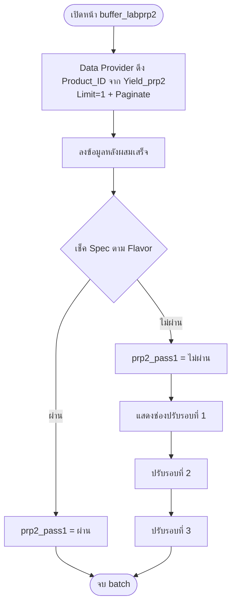

# buffer_labprp2 (PRP2)

หน้ากรอกข้อมูลการผลิตของ **Buffer Lab** ใน PRP2

## 1. สิทธิ์การเข้าถึง

| ผู้ใช้ | เข้าถึงหน้า | สิทธิ์ |
|---|---|---|
| Sup | ได้ | เพิ่ม / อัพเดต / ลบ **Flavor, Batch, Size** (กระทบตาราง `prp_2_table`, `Yield_prp2`, `Finish-good`) และตรวจสอบข้อมูล |
| Lab | ได้ | ลงข้อมูลผลตรวจ Lab |

## 2. การดึงข้อมูล (Data Provider + Paginate)

- ใช้ **Data Provider** ดึง Product_ID จากตาราง `Yield_prp2`
- ตั้ง **Limit = 1** เพื่อแสดงทีละ 1 แถว (1 batch)
- เปิด **Paginate** เพื่อดึงแถวอื่น (batch อื่น) มาแสดง

## 3. ขั้นตอนการลงข้อมูล Buffer

1. หลังผสมเสร็จ
2. ปรับรอบที่ 1
3. ปรับรอบที่ 2
4. ปรับรอบที่ 3

**เงื่อนไขแสดง:** ช่อง "ปรับรอบที่ 1" จะแสดงก็ต่อเมื่อ `prp2_pass1 = ไม่ผ่าน` (หลังผสมเสร็จไม่ผ่าน spec)



## 4. การเช็คค่า Spec

### ทำไม PRP2 ต้องเช็คจาก Flavor

PRP1 และ PRP3 ทุก batch ใน Product_ID เดียวกันเป็นสินค้าเดียวกัน แต่ **PRP2 มีการสลับ product ระหว่าง batch** เช่น

| Batch | Flavor |
|---|---|
| 1 | A |
| 2 | A |
| 3 | B |
| 4 | B |

จึงเช็ค spec ตาม Product ของ Product_ID ไม่ได้ ต้องอ่านจาก **Flavor** ของแถวที่ Paginate แสดงอยู่ ซึ่งเปลี่ยนไปตามแต่ละ batch

### Query

```sql
SELECT *
FROM PRP_Spec
WHERE Milk_Source = {{source}}
  AND (
        Flavor = {{flavor}}
        OR Flavor = LEFT({{flavor}}, CHARINDEX('-', {{flavor}} + '-') - 1)
        OR {{flavor}} IS NULL
        OR {{flavor}} = ''
      )
```

### อธิบาย

| เงื่อนไข | ความหมาย |
|---|---|
| `Milk_Source = {{source}}` | กรองตามแหล่งน้ำนม |
| `Flavor = {{flavor}}` | Flavor ตรงกันทั้งชื่อ |
| `Flavor = LEFT({{flavor}}, CHARINDEX('-', {{flavor}} + '-') - 1)` | ตัดเอาเฉพาะส่วนหน้าเครื่องหมาย `-` ไปเทียบ เช่น `A-1` → `A` |
| `{{flavor}} IS NULL OR {{flavor}} = ''` | ถ้ายังไม่มี Flavor ให้ดึง spec ทั้งหมดของ source นั้น |

**หมายเหตุ:** `{{flavor}} + '-'` ต่อ `-` ไว้ท้าย เพื่อให้ `CHARINDEX` หาเจอเสมอ ถ้า Flavor ไม่มี `-` ผลของ `LEFT` จะเป็น Flavor เต็ม ไม่เกิด error

## 5. ปุ่ม Recheck

- ใช้ในกรณีฉุกเฉิน
- ลงข้อมูล Lab ที่เช็คใหม่ได้ **1 ครั้ง**

## 6. ปุ่มเปลี่ยน Batch (Update State `currentPage`)

### ปัญหา

เมื่อเปิด Paginate ลูกศรเลื่อนอยู่มุมขวาล่างของหน้าจอ และเลื่อนได้ทีละหน้า **ข้ามไป batch ที่ต้องการไม่ได้** เช่น batch 1 → batch 5

### วิธีแก้


1. สร้างปุ่มตามเลข batch จาก `prp_2_table.Batch`
2. เมื่อกด ใช้ **Update State** ชื่อ `currentPage` เก็บเลข batch
3. Data Provider ใช้ `currentPage` เป็น **Filter** แสดงข้อมูลเฉพาะ batch นั้น

### สีของปุ่ม

| สี | ความหมาย |
|---|---|
| ⚫ ดำ | กำลังเลือก batch นั้นอยู่ |
| 🟡 เหลือง | Lab ลงข้อมูลแล้ว แต่ยังไม่ผ่าน |
| 🟢 เขียว | ลงข้อมูลผ่านแล้ว |
| 🔵 ฟ้า | Sup ตรวจสอบแล้ว |
