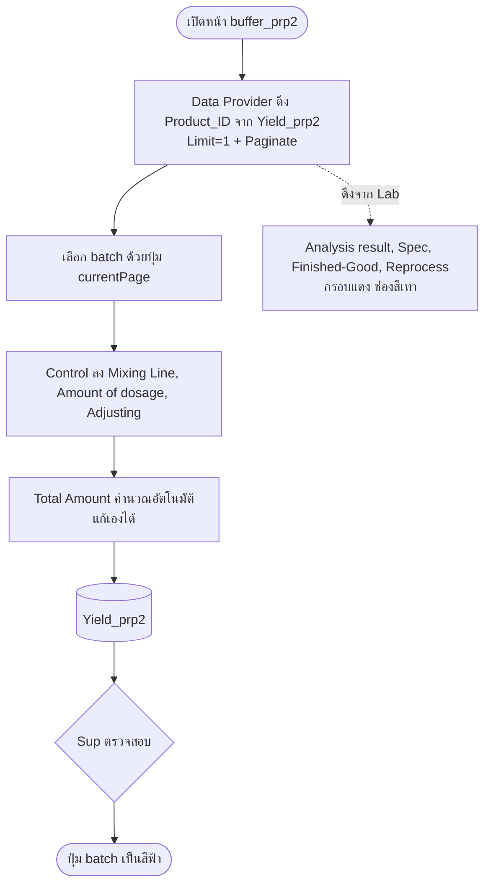

# buffer_prp2 (PRP2)

หน้ากรอกข้อมูลการผลิตของ **Buffer Control** ใน PRP2

## 1. สิทธิ์การเข้าถึง

| ผู้ใช้ | เข้าถึงหน้า | สิทธิ์ |
|---|---|---|
| Sup | ได้ | เพิ่ม / อัพเดต / ลบ **Flavor, Batch, Size** (กระทบตาราง `prp_2_table`, `Yield_prp2`, `Finish-good`) และตรวจสอบข้อมูล |
| Control | ได้ | ลงข้อมูลการผลิต Buffer |

## 2. ตารางที่ใช้

| ตาราง | เก็บข้อมูล |
|---|---|
| `prp_2_table` | Product_ID, Flavor, Batch, size |
| `Yield_prp2` | ข้อมูลการผลิต และดึงข้อมูลของ Lab |
| `Finish-good` | ดึงข้อมูลนมที่ผ่านการฆ่าเชื้อแล้ว |

## 3. การดึงข้อมูล (Data Provider + Paginate)

- ใช้ **Data Provider** ดึง Product_ID จากตาราง `Yield_prp2`
- ตั้ง **Limit = 1** แสดงทีละ 1 แถว (1 batch)
- เปิด **Paginate** เพื่อดึงแถวอื่น (batch อื่น) มาแสดง

## 4. ข้อมูลในหน้า

### 4.1 Control ลงเอง

| ช่อง |
|---|
| Mixing Line |
| Amount of dosage |
| Adjusting |

### 4.2 ดึงมาจาก Lab (ลงข้อมูลเองไม่ได้)

| ช่อง |
|---|
| Analysis result |
| Spec |
| Finished-Good |
| Reprocess |

แสดงเป็น **กรอบสีแดง** และ **ช่องสีเทา** เพื่อไม่ให้ลงข้อมูล

## 5. Total Amount (คำนวณอัตโนมัติ)

```js
const n = v => Number(v) || 0;

return (
  n($("New Form.Fields.c_UVWater1")) +
  n($("New Form.Fields.a_yoghurtbase")) +
  n($("New Form.Fields.a_liquid")) +
  n($("New Form.Fields.a_UVWater1")) +
  n($("New Form.Fields.a_UVWater2")) +
  n($("New Form.Fields.a_citric1")) +
  n($("New Form.Fields.a_citric2"))
);
```

### อธิบาย

- `const n = v => Number(v) || 0;` แปลงค่าเป็นตัวเลข ถ้าว่าง หรือไม่ใช่ตัวเลข (NaN, undefined, null, "") จะให้เป็น `0` เพื่อไม่ให้ผลรวมเพี้ยนเป็น `NaN`
- `$("New Form.Fields.xxx")` ดึงค่าจากฟิลด์ในฟอร์มชื่อ `New Form`
- นำ 7 ฟิลด์มาบวกกัน

| ฟิลด์ที่รวม |
|---|
| `c_UVWater1` |
| `a_yoghurtbase` |
| `a_liquid` |
| `a_UVWater1` |
| `a_UVWater2` |
| `a_citric1` |
| `a_citric2` |

> ค่าที่คำนวณได้เป็นค่าเริ่มต้น **ผู้ใช้งานแก้ไขเองได้**

## 6. ปุ่มเปลี่ยน Batch (Update State `currentPage`)

### ปัญหา

เมื่อเปิด Paginate ลูกศรเลื่อนอยู่มุมขวาล่างของหน้าจอ และเลื่อนได้ทีละหน้า **ข้ามไป batch ที่ต้องการไม่ได้** เช่น batch 1 → batch 5

### วิธีแก้


### สีของปุ่ม

| สี | ความหมาย |
|---|---|
| ⚫ ดำ | กำลังเลือก batch นั้นอยู่ |
| 🟢 เขียว | ลงข้อมูลครบ |
| 🔵 ฟ้า | Sup ตรวจสอบแล้ว |

## 7. Workflow


