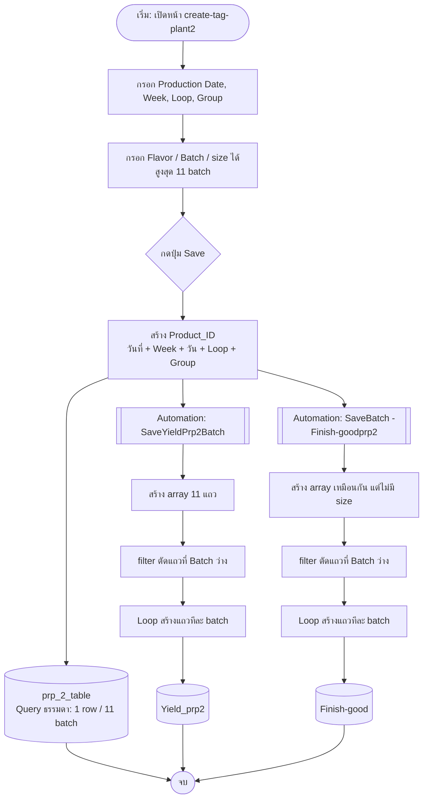

# create-tag-plant2 (PRP2)

หน้าสำหรับสร้าง **Product_ID** ของ PRP2 แล้วบันทึกลง 3 ตารางพร้อมกัน

## 1. Input ที่ใช้สร้าง Product_ID

| Field | ความหมาย | ตัวอย่าง |
|---|---|---|
| Production Date | วันที่ผลิต | 12/02/2026 |
| Week | สัปดาห์ | 31 |
| Day | ได้จากวันที่อัตโนมัติ (Su, Mo, Tu, We, Th, Fr, Sa) | Fr |
| Loop | รอบการผลิต | 1 |
| Group | กลุ่ม/เครื่อง | H |

**รูปแบบ:** `{Date}-{Week}{Day}{Loop}-{Group}`

ตัวอย่าง: `120226-31Fr1-H`

- Production Date = 120226
- Week = 31
- Fr = วันศุกร์
- Loop = 1
- Group = H

## 2. ตารางที่บันทึก

| ตาราง | เก็บข้อมูล | วิธี Save | จำนวนแถว |
|---|---|---|---|
| `prp_2_table` | Product_ID, Flavor, Batch, size | Query ธรรมดา | 1 row / 11 batch |
| `Yield_prp2` | ข้อมูลการผลิต | Automation `SaveYieldPrp2Batch` | 1 row / 1 batch |
| `Finish-good` | นมที่ผ่านการฆ่าเชื้อแล้ว | Automation `SaveBatch -Finish-goodprp2` | 1 row / 1 batch |

> `SaveBatch -Finish-goodprp2` ใช้โค้ดเหมือน `SaveYieldPrp2Batch` ต่างกันที่ **ไม่เก็บ size**

### เหตุผลที่เก็บข้อมูลต่างรูปแบบกัน

| ตาราง | รูปแบบ | เหตุผล |
|---|---|---|
| `prp_2_table` | เก็บเป็น **คอลัมน์** (11 batch ใน 1 แถว) | ผู้ใช้เข้ามาดูภาพรวมการผลิต จะเห็น 1 แถวต่อ 1 Product_ID และรู้ทันทีว่า Product_ID นั้นผลิตรวมกี่ batch |
| `Yield_prp2` | เก็บเป็น **แถว** (1 batch = 1 แถว) | ข้อมูลมีจำนวนมาก ถ้าเก็บ 11 batch เป็นคอลัมน์ ตารางจะมีคอลัมน์เต็มและยากต่อการแก้ไข |
| `Finish-good` | เก็บเป็น **แถว** (1 batch = 1 แถว) | เหตุผลเดียวกับ `Yield_prp2` |

## 3. Workflow การสร้าง Product_ID



## 4. อธิบายโค้ด (Automation `SaveYieldPrp2Batch`)

### 4.1 แปลงวันที่

```js
let dateTimeString = $("trigger.fields.Product Date");
let dateTime = new Date(dateTimeString);
```
ดึงค่า Product Date จาก trigger (ข้อมูลที่ส่งมาจากฟอร์ม) แล้วแปลงเป็น object `Date`

```js
let date = String(dateTime.getDate()).padStart(2, '0');
let month = String(dateTime.getMonth() + 1).padStart(2, '0');
let year = (dateTime.getFullYear() % 100).toString().padStart(2, '0');
```
- `getDate()` = วันที่ของเดือน
- `getMonth() + 1` = เดือน (JavaScript นับเดือนจาก 0 จึงต้อง +1)
- `getFullYear() % 100` = ปี 2 หลัก (2026 → 26)
- `padStart(2, '0')` = เติม 0 ข้างหน้าให้ครบ 2 หลัก (เช่น 2 → 02)

### 4.2 หาชื่อวัน

```js
let dayNames = ["Su", "Mo", "Tu", "We", "Th", "Fr", "Sa"];
let day = dayNames[dateTime.getDay()];
```
`getDay()` คืนค่า 0–6 (0 = อาทิตย์) ใช้เป็น index ดึงตัวย่อวัน

### 4.3 ดึงค่าจากฟอร์ม

```js
let week = $("trigger.fields.Week");
let loop = $("trigger.fields.Loop");
let MC = $("trigger.fields.Group");
```

### 4.4 ประกอบ Product_ID

```js
let productId = `${year}${month}${date}-${week}${day}${loop}-${MC}`;
```
นำทุกส่วนมาต่อกันเป็นสตริงเดียว ใช้ร่วมกันทุกแถวของ batch ในรอบนี้

### 4.5 สร้างแถวข้อมูล

```js
return [
  { Group: MC, Week: week, Flavor: $("trigger.fields.Flavor1"),
    Batch: $("trigger.fields.Batch1"), size: $("trigger.fields.size1"),
    Product_ID: productId, ProductDate: dateTimeString },
  // ... ถึง Flavor11 / Batch11 / size11
]
```
สร้าง array ของ object 11 ตัว (1 ตัว = 1 batch) ทุกตัวมี Group, Week, Product_ID, ProductDate เหมือนกัน ต่างกันที่ Flavor, Batch, size

### 4.6 ตัดแถวว่าง

```js
.filter(item => item.Batch && item.Batch.toString().trim() !== "")
```
เก็บเฉพาะแถวที่มี Batch (ไม่ว่าง ไม่เป็นช่องว่างล้วน) เช่น กรอก 7 batch จะเหลือ 7 แถว ไม่สร้างแถวขยะ

### 4.7 ผลลัพธ์

ค่าที่ `return` เป็น array ส่งต่อให้ step **Loop** ใน Automation เพื่อ Create Row ลงตารางทีละ object

## 5. ข้อควรระวัง

- **ลำดับวันที่:** โค้ดต่อเป็น `${year}${month}${date}` ได้ **yymmdd** (12 ก.พ. 2026 → `260212`) แต่ตัวอย่างเอกสารเป็น `120226` (ddmmyy) ถ้าต้องการ ddmmyy ให้เปลี่ยนเป็น `${date}${month}${year}`
- **Timezone:** ถ้า Product Date มาเป็นสตริง ISO (UTC) `getDate()` อาจเลื่อนวันตามเขตเวลา ควรทดสอบกับวันที่จริง
- **จำนวน batch:** รองรับสูงสุด 11 ถ้าเพิ่มต้องเพิ่มทั้งฟอร์มและแถวในโค้ด
