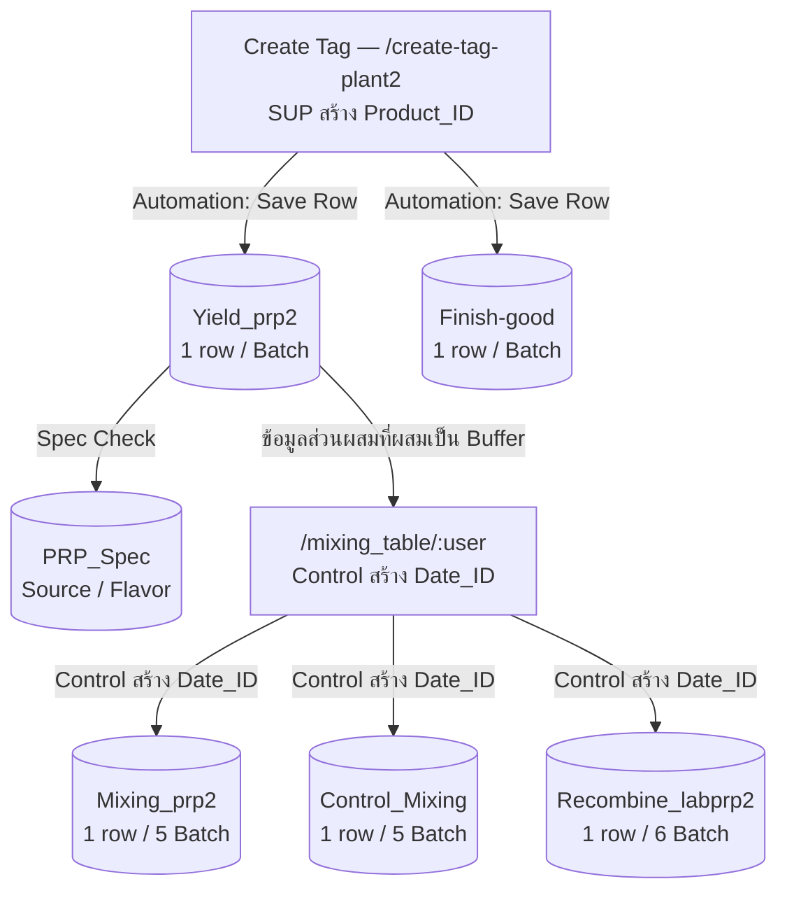

# PRP2 — Dairy Mixing and Quality Control

[← PRP overview](../README.md)

## 📌 Overall Project Overview

**PRP2 (Production Building 2)** คืออาคารการผลิตที่ 2 ของระบบการผลิต โดยมีหน้าที่หลักในการผลิต **นมเปรี้ยว (Fermented Milk)** และมีการส่ง **นมสด (Fresh Milk)** และ **นมเปรี้ยว (Fermented Milk)** ไปยัง PRP1 และ PRP3 เพื่อใช้ในกระบวนการผลิตต่อไป

นอกจากการเก็บข้อมูลการผลิต PRP2 ยังมีส่วนสำหรับจัดการข้อมูล **Mixing** ซึ่งใช้สำหรับบันทึกข้อมูลส่วนผสม การควบคุมการผสมนม และการตรวจสอบคุณภาพ โดยแบ่งการทำงานของ Mixing ออกเป็น **6 Groups ได้แก่ F, G, H, I, J และ K**

ระบบ PRP2 ถูกพัฒนาขึ้นเพื่อจัดเก็บข้อมูลการผลิต การตรวจสอบ การจัดการข้อมูลส่วนผสม การควบคุมการผสมนม และข้อมูลผลิตภัณฑ์หลังผ่านกระบวนการฆ่าเชื้อ โดยข้อมูลแต่ละส่วนเชื่อมโยงกันผ่าน `Product_ID`, `Batch` และ `Date_ID`

---

## 👥 System Users

ระบบ PRP2 มีผู้ใช้งานหลัก 3 กลุ่ม

| User         | Responsibility                                                    |
| ------------ | ----------------------------------------------------------------- |
| **SUP**      | สร้าง `Product_ID` และดำเนินการในส่วนที่ต้องใช้สิทธิ์ SUP         |
| **Control**  | กรอกและตรวจสอบข้อมูลด้าน Control และข้อมูลที่เกี่ยวข้องกับ Mixing |
| **Operator** | กรอกข้อมูลการผลิตและข้อมูลที่เกิดขึ้นในแต่ละกระบวนการ             |

สิทธิ์การเข้าถึงและการแก้ไขข้อมูลของแต่ละหน้าจะขึ้นอยู่กับหน้าที่ของผู้ใช้งาน

---

# 🔄 Workflow

**1. Create Tag**

SUP สร้าง `Product_ID` ผ่าน `/create-tag-plant2`

เมื่อสร้าง `Product_ID` ระบบจะใช้ Automation สร้าง Row สำหรับ Product และ Batch ที่เกี่ยวข้องให้อัตโนมัติใน

* `Yield_prp2` — 1 row / Batch
* `Finish-good` — 1 row / Batch

**2. Production**

ผู้ใช้งานกรอกข้อมูลการผลิตใน `Yield_prp2` ซึ่งครอบคลุมข้อมูล Production, Buffer Lab และ Buffer Control

**3. Spec Check**

ข้อมูลที่เกี่ยวข้องกับการผลิตจะถูกตรวจสอบกับ `PRP_Spec` โดยใช้ข้อมูล เช่น `Source` และ `Flavor` เพื่อค้นหา Specification ที่กำหนด

Control เป็นผู้สร้าง `Date_ID` เพื่อใช้เป็นข้อมูลอ้างอิงของข้อมูล Mixing

**4. Mixing Data**

ข้อมูลจาก Mixing จะถูกจัดเก็บตามกระบวนการที่เกี่ยวข้อง ได้แก่

* `Mixing_prp2` — 1 row / 5 Batch
* `Control_Mixing` — 1 row / 5 Batch
* `Recombine_labprp2` — 1 row / 6 Batch

**5. Finish-good**

`Finish-good` ใช้เก็บข้อมูลนมที่ผ่านกระบวนการฆ่าเชื้อแล้ว โดยระบบเตรียม Row ตาม Batch ตั้งแต่ขั้นตอน Create Tag

---

# 🗄️ Database

| Table               | รายละเอียด                                                               |
| ------------------- | ------------------------------------------------------------------------ |
| `prp_2_table`       | เก็บข้อมูลหลักของ Product ได้แก่ `Product_ID`, `Flavor`, `Batch`, `Size` |
| `Yield_prp2`        | เก็บข้อมูลการผลิตของ PRP2 รวมถึง Buffer Lab และ Buffer Control           |
| `Recombine_labprp2` | เก็บข้อมูล LAB และ Control ของการผสมนม Recombine                         |
| `Mixing_prp2`       | เก็บข้อมูลส่วนผสมอื่น ๆ ของ LAB                                          |
| `Control_Mixing`    | เก็บข้อมูลส่วนผสมอื่น ๆ ของ Control                                      |
| `Finish-good`       | เก็บข้อมูลนมที่ผ่านกระบวนการฆ่าเชื้อแล้ว                                 |
| `PRP_Spec`          | ใช้เก็บและตรวจสอบค่า Specification ของผลิตภัณฑ์                          |

---
# 🏭 PRP2 Role in Smart Factory

PRP2 เป็นส่วนหนึ่งของกระบวนการผลิตภายใน **Smart Factory Platform** โดยมีหน้าที่หลักในการจัดการข้อมูลการผลิต การควบคุมคุณภาพ และการจัดการข้อมูลส่วนผสมของผลิตภัณฑ์ โดยมีรายละเอียดดังนี้

1. **Production Data** — จัดเก็บข้อมูลการผลิตของ PRP2 รวมถึงข้อมูล Production, Buffer Lab และ Buffer Control

2. **Quality Control** — ตรวจสอบข้อมูลการผลิตและค่าคุณภาพของผลิตภัณฑ์ตาม Specification ที่กำหนด โดยอ้างอิงข้อมูลจาก `PRP_Spec`

3. **Recombine Control** — จัดเก็บข้อมูล LAB และ Control ที่เกี่ยวข้องกับกระบวนการผสมนม Recombine ใน `Recombine_labprp2`

4. **Finish-good** — จัดเก็บข้อมูลผลิตภัณฑ์หลังผ่านกระบวนการฆ่าเชื้อ โดยระบบเตรียมข้อมูลตาม `Batch` ตั้งแต่ขั้นตอนการสร้าง `Product_ID`

5. **Data Traceability** — เชื่อมโยงข้อมูลระหว่างกระบวนการผลิตและการจัดการ Mixing ผ่าน `Product_ID`, `Batch` และ `Date_ID` เพื่อให้สามารถตรวจสอบและติดตามข้อมูลย้อนหลังได้

6. **Production Transfer** — รองรับการส่ง **นมสด (Fresh Milk)** และ **นมเปรี้ยว (Fermented Milk)** ไปยัง PRP1 และ PRP3 เพื่อใช้ในกระบวนการผลิตต่อไป
---
