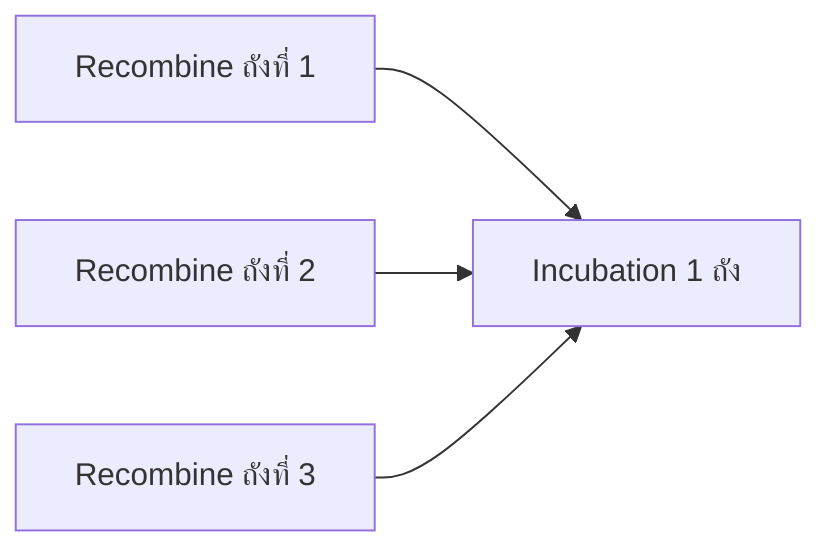
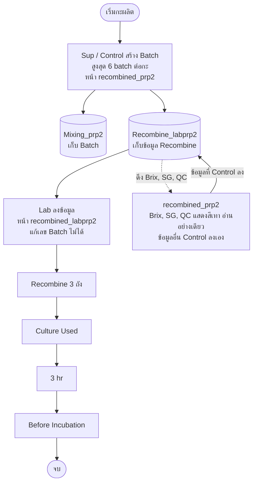

# Recombined PRP2

## 1. กระบวนการ Recombined

นม Recombined: **Recombine 3 ถัง → ได้ Incubation (Incu) 1 ถัง**

## 2. หน้าที่เกี่ยวข้อง

| หน้า | ผู้ใช้งาน | ข้อมูลที่ลง |
|---|---|---|
| `recombined_prp2` | Sup, Control | ข้อมูล Recombine ของ Control |
| `recombined_labprp2` | Sup, Lab | ข้อมูล Recombine ของ Lab |

## 3. ตารางที่ใช้

| ตาราง | เก็บข้อมูล |
|---|---|
| `Mixing_prp2` | ข้อมูล Batch |
| `Recombine_labprp2` | ข้อมูล Recombine ของ Lab / Control |

## 4. หน้า `recombined_prp2` (Control)

- สิทธิ์เข้าถึง: Sup, Control
- สิทธิ์แก้ไข **Batch**: Sup และ Control เพิ่ม / อัพเดต / ลบ ได้ โดยจะเปลี่ยนข้อมูลในตาราง `Mixing_prp2` และ `Recombine_labprp2`
- **1 กะ สร้างได้ 6 Batch**
- Control ลงข้อมูล Recombine อื่นๆ ได้ตามปกติ
- ยกเว้น **Brix, SG, QC** ที่ดึงมาจากหน้า `recombined_labprp2` (ที่ Lab ลงไว้) อัตโนมัติ และแสดงเป็น **สีเทา** (อ่านอย่างเดียว กรอกเองไม่ได้)

## 5. หน้า `recombined_labprp2` (Lab)

- สิทธิ์เข้าถึง: Sup, Lab
- **Lab แก้เลข Batch ไม่ได้**
- ข้อมูลที่ลง:
  1. Recombine 3 ถัง
  2. Culture Used
  3. 3 hr
  4. Before Incubation

## 6. Workflow

## 7. สิทธิ์การเข้าถึง

| หน้า | Sup | Lab | Control |
|---|---|---|---|
| `recombined_prp2` | ✅ | ❌ | ✅ |
| `recombined_labprp2` | ✅ | ✅ | ❌ |
