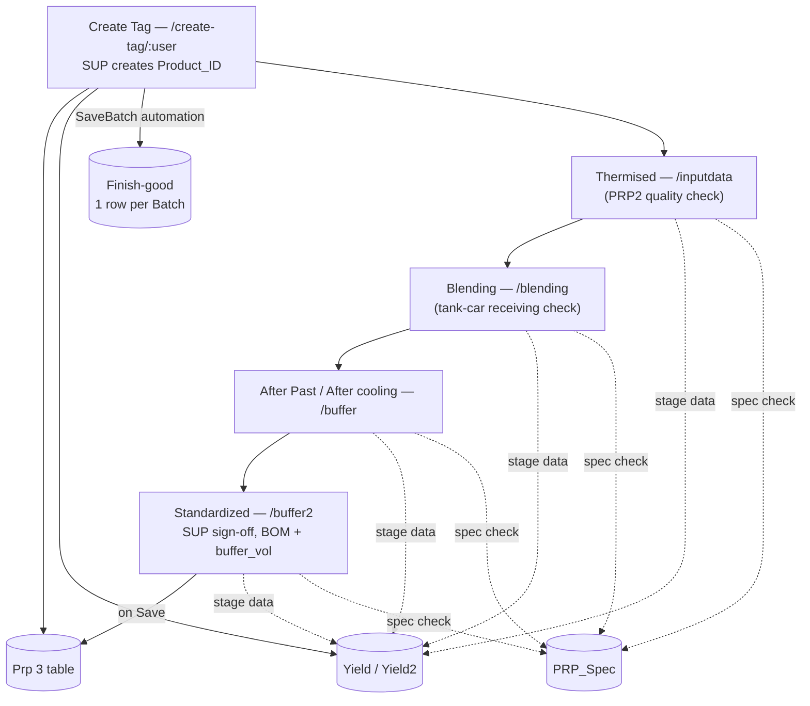
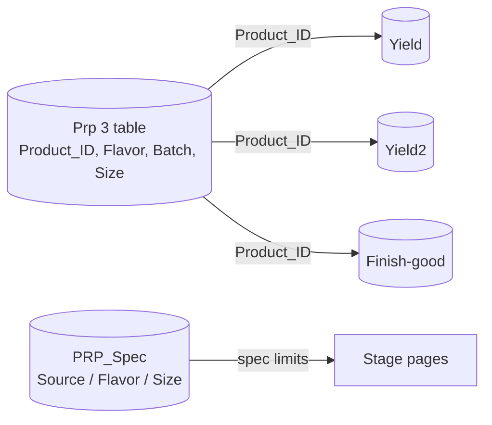

# PRP3 — Overview

[← PRP overview](../README.md)

**PRP3 is Production Building 3.** It makes Fresh Milk, Fermented Milk, Soy Milk, Tea, Coffee and
Juice on two line groups:

| Group | Line |
|---|---|
| **M** | Fresh Milk |
| **L** | Fermented Milk, Tea, Coffee, Soy Milk |

## Workflow

1. **SUP creates the `Product_ID`** on `/create-tag/:user`. It is written to `Prp 3 table`, a row is
   created in `Yield` (or `Yield2` for Fermented Milk), and **SaveBatch** creates the Finish-good rows.
2. **Operators enter the four stages** — Thermised, Blending, After Past, Standardized — for up to
   8 Batches per page. Every value is checked against `PRP_Spec`.
3. **Standardized** is signed off by the SUP, calculates BOM volume and `buffer_vol`, and on Save
   writes back to `Yield` and `Prp 3 table`.
4. **Finish-good** records the after-sterilization check for each Batch.

If an automatic step fails or produces wrong data, the operator can create the record manually.

## Pages in this folder

| Page | Covers |
|---|---|
| [prp3-table.md](prp3-table.md) | `Prp 3 table` fields, `Product_ID` format, Create Tag page access |
| [yield.md](yield.md) | The four stage pages, product types, `Yield` / `Yield2`, spec check, BOM / `buffer_vol` formulas, permissions |
| [finish-good.md](finish-good.md) | `Finish-good` table and the **SaveBatch** automation (shared by all plants) |
| [problems.md](problems.md) | Known design issues and improvement ideas |

## Tables

| Table | Purpose |
|---|---|
| `Prp 3 table` | Core run data: `Product_ID`, Week, Loop, Group, Flavor, Batch, Size |
| `Yield` | Stage data for Demol Milk, Soy Milk, Tea |
| `Yield2` | Stage data for Fermented Milk — added because `Yield` ran out of columns |
| `Finish-good` | After-sterilization check, one row per Batch |
| `PRP_Spec` | Spec limits used to validate entered values |

ส่วน **Overall Project Overview** นี้จึงทำหน้าที่เป็นภาพรวมสำหรับผู้ที่ไม่เคยใช้งาน PRP Application มาก่อน เพื่อให้เข้าใจวัตถุประสงค์ ผู้ใช้งาน กระบวนการผลิต การเชื่อมโยงของข้อมูล และบทบาทของ PRP ภายใน Smart Factory Platform ก่อนเข้าสู่รายละเอียดทางเทคนิคของแต่ละหน้า
