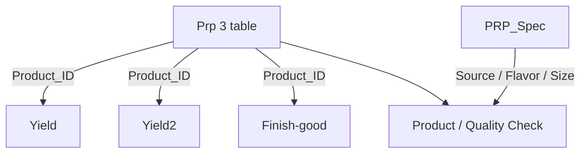

# 🏭 Overall Project Overview

## PRP Dairy Mixing and Quality Control

### 📌 Project Overview

**PRP (Dairy Mixing and Quality Control)** เป็นระบบสำหรับจัดเก็บและจัดการข้อมูลที่เกี่ยวข้องกับกระบวนการผลิตภายใน **PRP 3**

**PRP 3 คืออาคารการผลิตที่ 3** ซึ่งรองรับการผลิตผลิตภัณฑ์หลายประเภท ได้แก่

* 🥛 นมสด
* 🌱 นมถั่วเหลือง
* 🍵 ชา
* ☕ กาแฟ
* 🥛 นมเปรี้ยว
* 🍊 น้ำผลไม้

ระบบถูกพัฒนาขึ้นเพื่อเปลี่ยนจากการจัดเก็บข้อมูลการผลิตในรูปแบบ **กระดาษ (Paper-based)** มาเป็น **ระบบดิจิทัล** เพื่อให้สามารถค้นหา ตรวจสอบ และนำข้อมูลไปใช้งานต่อได้สะดวกและรวดเร็วยิ่งขึ้น

---

# 🎯 Why Was PRP Developed?

เดิมการจัดเก็บข้อมูลในกระบวนการผลิตใช้เอกสารและแบบฟอร์มกระดาษเป็นหลัก ทำให้เกิดปัญหา เช่น

* 📄 มีการใช้กระดาษจำนวนมาก
* 🔎 การค้นหาข้อมูลย้อนหลังทำได้ยาก
* ⏱️ ใช้เวลาในการตรวจสอบข้อมูล
* 📚 ข้อมูลกระจายอยู่ในเอกสารหลายชุด
* 🔄 การนำข้อมูลไปใช้งานต่อทำได้ไม่สะดวก
* 📊 การรวบรวมข้อมูลเพื่อวิเคราะห์หรืออ้างอิงทำได้ยาก

จึงได้มีการพัฒนา **PRP Application** เพื่อจัดเก็บข้อมูลในรูปแบบดิจิทัล ลดการใช้กระดาษ และทำให้ข้อมูลสามารถค้นหา ตรวจสอบ และนำไปใช้ต่อในส่วนต่าง ๆ ได้ง่ายขึ้น

---

# 👥 System Users

ผู้ใช้งานหลักของระบบประกอบด้วย

| User         | Responsibility                                                          |
| ------------ | ----------------------------------------------------------------------- |
| **SUP**      | สร้าง Product_ID และกรอกข้อมูลที่เกี่ยวข้องกับการผลิตในส่วนที่รับผิดชอบ |
| **Operator** | กรอกข้อมูลการผลิตและข้อมูลที่เกิดขึ้นในกระบวนการผลิต                    |

---

# 🔄 Overall Production Workflow

กระบวนการทำงานหลักของ PRP Application เริ่มตั้งแต่การสร้าง Product_ID ไปจนถึงการบันทึกข้อมูลสินค้าสำเร็จรูป


### Production Process

1. **SUP Creates Product_ID**
   SUP สร้างเลข `Product_ID` เพื่อใช้เป็นหมายเลขอ้างอิงของผลิตภัณฑ์และ Batch

2. **Thermised**
   บันทึกข้อมูลจากกระบวนการ Thermised

3. **Blending**
   บันทึกข้อมูลจากกระบวนการ Blending

4. **After Past**
   บันทึกข้อมูลหลังผ่านกระบวนการที่เกี่ยวข้อง

5. **Standardized**
   บันทึกข้อมูลในขั้นตอน Standardized

6. **Finish-good**
   ขั้นตอนสุดท้ายสำหรับบันทึกข้อมูลสินค้าสำเร็จรูป

---

# 🆔 Product_ID

`Product_ID` เป็นข้อมูลสำคัญที่ใช้เป็น **ตัวระบุผลิตภัณฑ์และตัวเชื่อมข้อมูลระหว่างแต่ละขั้นตอนของกระบวนการผลิต**

ทุกตารางที่เกี่ยวข้องกับกระบวนการผลิตจะมีการจัดเก็บ `Product_ID`

ดังนั้นเมื่อผู้ใช้งานค้นหาด้วย `Product_ID` ระบบจะสามารถค้นหาและแสดงข้อมูลการผลิตที่เกี่ยวข้องกับ Product นั้นได้

```text
                         Product_ID
                    ┌────────┼────────┬────────┐
                    │        │        │        │
                    ▼        ▼        ▼        ▼
                Thermised Blending After Past Standardized
                    │        │        │        │
                    └────────┴────────┴────────┘
                             │
                             ▼
                         Finish-good
```

> **Product_ID ทำหน้าที่เป็น Reference หลักของข้อมูลการผลิต** ทำให้สามารถติดตามข้อมูลของผลิตภัณฑ์เดียวกันผ่านแต่ละขั้นตอนของกระบวนการผลิตได้

---

# ✍️ Manual vs Automatic Data

ระบบแบ่งการกรอกข้อมูลออกเป็น 2 รูปแบบ ได้แก่ **ข้อมูลที่ผู้ใช้งานกรอกเอง** และ **ข้อมูลที่ระบบสร้างหรือคำนวณให้อัตโนมัติ**

## 👤 Manual Input

ข้อมูลส่วนใหญ่ในกระบวนการผลิตจะถูกกรอกโดยผู้ใช้งาน

### SUP

SUP รับผิดชอบในส่วนของการสร้าง `Product_ID`

เมื่อสร้าง `Product_ID` แล้ว ระบบจะบันทึกข้อมูลลงในตารางที่เกี่ยวข้อง

นอกจากนี้ SUP ยังมีข้อมูลบางส่วน เช่น

* BOM
* Buffer Volume (`buffer_vol`)

โดย `buffer_vol` จะมีส่วนที่ระบบช่วยคำนวณให้

### Operator

Operator เป็นผู้กรอกข้อมูลที่เกิดขึ้นจริงระหว่างกระบวนการผลิต เช่น

* Thermised
* Blending
* After Past
* Standardized
* ข้อมูลการผลิตอื่น ๆ ที่เกี่ยวข้อง

---

# ⚙️ Automatic Data Generation

ในหน้า **Finish-good** เมื่อ SUP สร้าง `Product_ID` ระบบจะทำการวนลูปเพื่อสร้างข้อมูลที่เกี่ยวข้องให้อัตโนมัติ

```text
SUP Creates Product_ID
          │
          ▼
    Save Product_ID
          │
          ▼
   Automatic Loop
          │
          ▼
     Finish-good
```

อย่างไรก็ตาม หากเกิดปัญหาจากการสร้างข้อมูลอัตโนมัติ หรือข้อมูลที่สร้างไม่ถูกต้อง **Operator สามารถสร้างข้อมูลใหม่ด้วยตนเองได้**

---

# 🗃️ Database Relationship

ตารางหลักที่เกี่ยวข้องกับข้อมูล PRP ได้แก่

* `Prp 3 table`
* `Yield`
* `Yield2`
* `PRP_Spec`
* `Finish-good`

---

## 📊 Prp 3 table

`Prp 3 table` ใช้เก็บข้อมูลหลักของ Product และ Batch เช่น

| Field        | Description               |
| ------------ | ------------------------- |
| `Product_ID` | หมายเลขอ้างอิงของ Product |
| `Week`       | Week ของการผลิต           |
| `Loop`       | Loop ของการผลิต           |
| `Group`      | Group ของผลิตภัณฑ์        |
| `Flavor`     | Flavor                    |
| `Batch`      | Batch                     |

ข้อมูลจาก `Prp 3 table` ถูกนำไปใช้เป็นข้อมูลอ้างอิงในตารางอื่น ๆ

---

## 📈 Yield

`Yield` ใช้ข้อมูล `Product_ID` จาก `Prp 3 table` เพื่อเชื่อมโยงข้อมูล Yield กับ Product ที่กำลังผลิต

```text
Prp 3 table
     │
     │ Product_ID
     ▼
   Yield
```

---

## 📈 Yield2

`Yield2` ใช้ `Product_ID` จาก `Prp 3 table` เช่นเดียวกัน เพื่อเชื่อมโยงข้อมูล Yield ในส่วนที่เกี่ยวข้อง

```text
Prp 3 table
     │
     │ Product_ID
     ▼
   Yield2
```

---

## 📦 Finish-good

`Finish-good` ใช้ `Product_ID` จาก `Prp 3 table` เพื่อเชื่อมโยงข้อมูลสินค้าสำเร็จรูปกับ Product ที่ผลิต

```text
Prp 3 table
     │
     │ Product_ID
     ▼
 Finish-good
```

---

## 🧪 PRP_Spec

`PRP_Spec` ใช้เป็นแหล่งข้อมูล Specification สำหรับการตรวจสอบผลิตภัณฑ์ โดยมีข้อมูลที่เกี่ยวข้อง เช่น

* Source
* Flavor
* Size

ข้อมูลจาก `PRP_Spec` สามารถนำมาใช้เป็นเกณฑ์อ้างอิงในการตรวจสอบข้อมูลของผลิตภัณฑ์

```text
PRP_Spec
   │
   ├── Source
   ├── Flavor
   └── Size
        │
        ▼
   Specification
        │
        ▼
 Product / Quality Check
```

---

# 🔗 Overall Data Relationship

ภาพรวมความสัมพันธ์ของตารางสามารถแสดงได้ดังนี้



> `Product_ID` เป็นข้อมูลสำคัญที่ใช้เชื่อมโยงข้อมูลของ Product ระหว่างตารางต่าง ๆ

---

# 🔍 How the System Works

ภาพรวมการทำงานของระบบสามารถสรุปได้ดังนี้

```text
┌───────────────────────────┐
│ 1. SUP Creates Product_ID │
└─────────────┬─────────────┘
              │
              ▼
┌───────────────────────────┐
│ 2. Production Data Entry  │
│    • Thermised             │
│    • Blending              │
│    • After Past            │
│    • Standardized          │
└─────────────┬─────────────┘
              │
              ▼
┌───────────────────────────┐
│ 3. Quality / Specification│
│    Check                   │
│    • PRP_Spec              │
└─────────────┬─────────────┘
              │
              ▼
┌───────────────────────────┐
│ 4. Yield                   │
│    • Yield                 │
│    • Yield2                │
└─────────────┬─────────────┘
              │
              ▼
┌───────────────────────────┐
│ 5. Finish-good             │
└───────────────────────────┘
```

---

# 🎯 Project Goals

PRP Application มีเป้าหมายหลักในการ

* 📄 ลดการใช้เอกสารและกระดาษ
* 🔎 ทำให้ค้นหาข้อมูลการผลิตได้ง่าย
* ⚡ ลดเวลาในการตรวจสอบข้อมูล
* 🗃️ จัดเก็บข้อมูลอย่างเป็นระบบ
* 🔗 เชื่อมโยงข้อมูลด้วย `Product_ID`
* 📊 ทำให้สามารถนำข้อมูลไปใช้งานต่อได้สะดวก
* 🏭 สนับสนุนการเปลี่ยนแปลงกระบวนการผลิตเข้าสู่ระบบ Digital และ Smart Factory

---

# 📖 Documentation Structure

หลังจากส่วน **Overall Project Overview** นี้ จะเป็นรายละเอียดเชิงเทคนิคของแต่ละส่วนใน PRP Application

```text
Overall Project Overview
        │
        ├── PRP1
        ├── PRP2
        ├── PRP3
        │
        ├── Pages
        ├── Tables
        ├── Queries
        ├── Automations
        └── Workflows
```

ส่วน **Overall Project Overview** นี้จึงทำหน้าที่เป็นภาพรวมสำหรับผู้ที่ไม่เคยใช้งาน PRP Application มาก่อน เพื่อให้เข้าใจวัตถุประสงค์ ผู้ใช้งาน กระบวนการผลิต การเชื่อมโยงของข้อมูล และบทบาทของ PRP ภายใน Smart Factory Platform ก่อนเข้าสู่รายละเอียดทางเทคนิคของแต่ละหน้า
