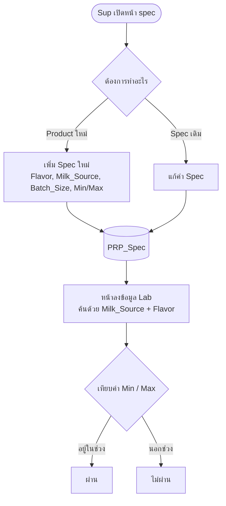

# spec

หน้าจัดการตาราง **PRP_Spec** ซึ่งเก็บค่า Spec ที่นำไปเช็คค่า **Min / Max** ของผล Lab แต่ละตัว

## 1. สิทธิ์การเข้าถึง

| ผู้ใช้ | เข้าถึงหน้า | สิทธิ์ |
|---|---|---|
| Sup | ได้ | แก้ Spec เดิม และเพิ่ม Spec ของ Product ใหม่ |

## 2. ตารางที่ใช้

| ตาราง | เก็บข้อมูล |
|---|---|
| `PRP_Spec` | ค่า Spec ที่ใช้เช็คค่า Min / Max ของผล Lab แต่ละตัว |

## 3. ความหมายของฟิลด์สำคัญ

| ฟิลด์ | ความหมาย |
|---|---|
| `Flavor` | ชื่อ Product นั้น |
| `Milk_Source` | ขั้นตอน/แหล่งของข้อมูล ใช้เป็นตัวย่อ (ดูตารางด้านล่าง) |
| `Batch_Size` | ขนาด batch (size) |

### ตัวย่อ `Milk_Source`

| ตัวย่อ | ความหมาย |
|---|---|
| `T` | Thermised |
| `BL` | Blending |
| `BU` | Buffer |
| `S` | Storage |
| `F` | Finish-good |
| `R` | Recombine |
| `DYG` | นมเปรี้ยว (Fermented Milk) |

## 4. การใช้งาน Spec

หน้าลงข้อมูลต่าง ๆ จะค้น Spec จาก `PRP_Spec` ด้วย `Milk_Source` + `Flavor` (+ `Batch_Size`) แล้วนำค่า Min / Max ไปเทียบกับผล Lab ที่กรอก

ตัวอย่าง: หน้า `buffer_labprp2` ค้นด้วย `Milk_Source` และ `Flavor` ของ batch ที่แสดงอยู่

## 5. Workflow

