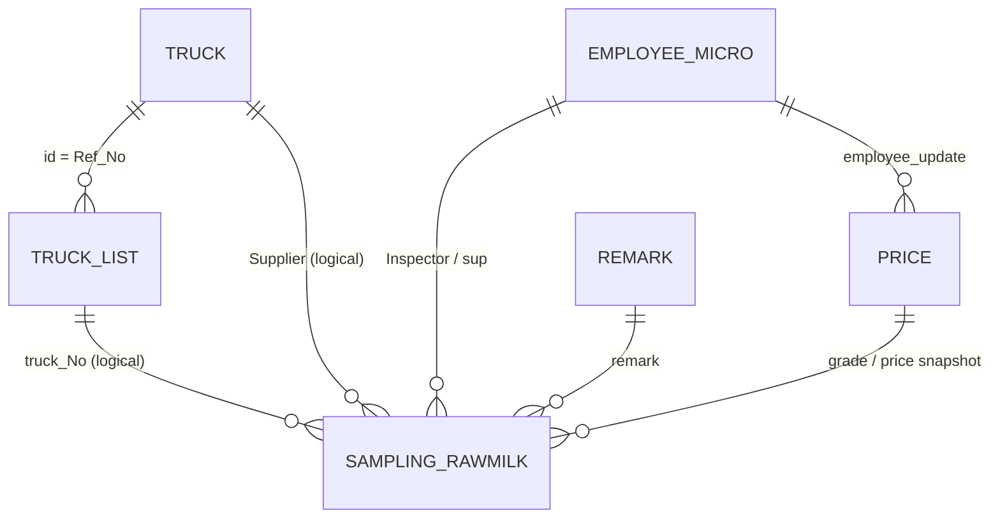
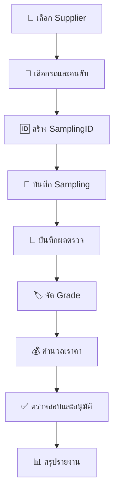

# 🥛 QSM RawMilk — Database & SQL Documentation

> เอกสารสรุปโครงสร้างฐานข้อมูลและ SQL Query ของแอปพลิเคชัน **QSM RawMilk**  
> ระบบฐานข้อมูล: **Microsoft SQL Server** · ใช้งานร่วมกับ **Budibase**  
> จัดทำจากภาพฐานข้อมูล 6 ภาพ และไฟล์ SQL จำนวน 14 ไฟล์ เมื่อวันที่ 3 กันยายน 2026

---
 


---
## 📚 สารบัญ

- [ภาพรวมระบบ](#-ภาพรวมระบบ)
- [รายการตาราง](#-รายการตาราง)
- [รายละเอียดตาราง](#-รายละเอียดตาราง)
- [ความสัมพันธ์ระหว่างตาราง](#-ความสัมพันธ์ระหว่างตาราง)
- [สรุป SQL แต่ละตัว](#-สรุป-sql-แต่ละตัว)
- [กฎการจัดเกรดและคำนวณราคา](#-กฎการจัดเกรดและคำนวณราคา)
- [ลำดับการทำงานหลัก](#-ลำดับการทำงานหลัก)
- [ข้อควรระวังที่ตรวจพบ](#-ข้อควรระวังที่ตรวจพบ)
- [คำแนะนำด้านโครงสร้างและประสิทธิภาพ](#-คำแนะนำด้านโครงสร้างและประสิทธิภาพ)

---

## 🎯 ภาพรวมระบบ

QSM RawMilk ใช้สำหรับบันทึกและติดตามการรับน้ำนมดิบ ตั้งแต่แผนรถเข้า ข้อมูลผู้ส่งมอบ รถและคนขับ น้ำหนัก ผลตรวจทางกายภาพ/เคมี/จุลชีววิทยา การจัดเกรด ไปจนถึงการคำนวณราคาสุทธิ

ข้อมูลหลักของแต่ละเที่ยวรถเก็บในตาราง `[Sampling RawMilk]` และใช้ `SamplingID` เป็นรหัสอ้างอิงทางธุรกิจ เช่น:

```text
QSM-20260817-0201-01
│   │        │   └─ ลำดับรายการ 2 หลัก
│   │        └──── รหัสแผนก + เครื่อง/จุดรับ
│   └───────────── วันที่รูปแบบ YYYYMMDD
└───────────────── คำนำหน้า QSM
```

### 🧭 ขอบเขตข้อมูล

1. 🚚 กำหนดผู้ส่งมอบ รถ และพนักงานขับรถ
2. 🧪 บันทึกผลตรวจคุณภาพน้ำนมดิบ
3. 🏷️ จัด Grade จากค่า Fat, SNF, FP, SPC และ SCC
4. 💰 คำนวณส่วนเพิ่ม/ส่วนลดต่อกิโลกรัมและราคารวม
5. ✅ บันทึกผลอนุมัติ ผู้ตรวจ และหมายเหตุ
6. 📊 สรุปจำนวน Grade จาก Sampling ที่เลือก

---

## 🗂️ รายการตาราง

| # | ตาราง | ประเภท | หน้าที่หลัก | คีย์ที่มองเห็น/คาดว่าใช้ |
|---:|---|---|---|---|
| 1 | `Sampling RawMilk` | Transaction | ข้อมูลหลักของการรับและตรวจน้ำนมดิบแต่ละเที่ยว | `SamplingID` |
| 2 | `Truck` | Master | รายชื่อผู้ส่งมอบน้ำนมดิบ | `id` |
| 3 | `TruckList` | Master | ทะเบียนรถและชื่อคนขับ แยกตามผู้ส่งมอบ | `id`, `Ref_No` |
| 4 | `Price` | Master/Config | ราคามาตรฐาน ช่วง Grade และอัตราปรับราคา | `id`, `Grade` |
| 5 | `Employee_Micro` | Master | รายชื่อพนักงานฝ่าย Micro/QSM | `id` |
| 6 | `Remark` | Master | รายการเหตุผลหรือหมายเหตุผิดปกติ | `ID` |
| 7 | `Sum_of_data` | Summary | ตารางหรือวิวสรุปข้อมูล | ไม่ปรากฏในภาพ |
| 8 | `Sum_Sampling` | Summary | ตารางหรือวิวสรุป Sampling | ไม่ปรากฏในภาพ |

> ⚠️ ภาพที่ได้รับไม่ได้แสดงหน้าโครงสร้างของ `Sum_of_data` และ `Sum_Sampling` และ SQL ในไฟล์แนบไม่ได้อ้างถึงสองตารางนี้ จึงยังระบุคอลัมน์และความสัมพันธ์ไม่ได้อย่างยืนยัน

---

## 🧱 รายละเอียดตาราง

### 1. 🥛 `Sampling RawMilk`

ตารางศูนย์กลางของระบบ หนึ่งแถวแทนข้อมูล Sampling/การรับน้ำนมดิบหนึ่งรายการ

| กลุ่มข้อมูล | คอลัมน์ | ความหมายโดยย่อ |
|---|---|---|
| รหัสและแผน | `SamplingID`, `Plan`, `Date` | รหัสรายการ เวลาในแผน และวันที่รับ |
| ผู้ส่งมอบ/รถ | `Supplier`, `grade`, `bill`, `truck_no`, `driver_name` | ผู้ส่งมอบ เกรดเบื้องต้น เลขบิล ทะเบียนรถ และคนขับ |
| น้ำหนัก | `W_kg`, `W_PDP` | น้ำหนักจริงและน้ำหนักจากระบบ/จุด PDP |
| เวลาในกระบวนการ | `T_arrived`, `T_sampling`, `T_QSM_P`, `T_goback` | เวลารถมาถึง เก็บตัวอย่าง เข้าจุด QSM และกลับ |
| อุณหภูมิถัง | `Temp_Tank_1`–`Temp_Tank_3` | อุณหภูมิของถังที่ 1–3 |
| ผล R/P รายถัง | `R_Tank_1`–`R_Tank_3`, `P_Tank_1`–`P_Tank_3` | ผลตรวจแยกรายถัง |
| การทดสอบเบื้องต้น | `Antibiotic_P`, `Alcohol_P` | ผลตรวจยาปฏิชีวนะและ Alcohol |
| เคมี | `Brix`, `SG`, `pH`, `TA`, `Fat`, `Protein`, `TS`, `SNF`, `FP` | ค่าคุณภาพทางกายภาพและเคมี |
| จุลชีววิทยารายถัง | `SPC_Tank_1`–`SPC_Tank_3`, `Coliform_1`–`Coliform_3`, `E_Tank_1`–`E_Tank_3` | ผล SPC, Coliform และ E. coli แยกรายถัง |
| จุลชีววิทยารวม | `SPC`, `SCC` | Standard Plate Count และ Somatic Cell Count |
| เอกสาร/ผลตรวจ | `Car_Alevent`, `invoice_no`, `Result`, `Appearance`, `Inspector`, `Material_document`, `remark` | ข้อมูลรถ เอกสาร ผลตรวจ ลักษณะ ผู้ตรวจ และหมายเหตุ |
| การอนุมัติ | `sup`, `sup_date`, `Status`, `NCR_Reject_No` | ผู้อนุมัติ วันที่อนุมัติ สถานะ และเลข NCR/Reject |
| ราคาตั้งต้น | `Std_Price` | ราคามาตรฐานต่อหน่วย |
| Grade | `Grade_SPC`, `Grade_SCC`, `Grade_FP`, `Grade_Fat`, `Grade_SNF` | ระดับคุณภาพของแต่ละตัวชี้วัด |
| อัตราปรับราคา | `rate_SPC`, `rate_SCC`, `rate_FP`, `rate_Fat`, `rate_SNF` | ส่วนเพิ่มหรือส่วนลดของแต่ละตัวชี้วัด |
| ราคาผลลัพธ์ | `Net_Price`, `Price` | ราคาสุทธิต่อหน่วยและราคารวม |

> ℹ️ ชนิดข้อมูล SQL ที่แน่นอนไม่ได้แสดงครบในภาพ รายการข้างต้นจึงสรุปจากคอลัมน์ใน `Create_Sampling.sql` และ `Update_data.sql`

### 2. 🚛 `Truck`

| คอลัมน์ | หน้าที่ | หมายเหตุ |
|---|---|---|
| `id` | รหัสผู้ส่งมอบ | ใช้เชื่อมกับ `TruckList.Ref_No` |
| `Supplier` | ชื่อผู้ส่งมอบน้ำนมดิบ | ในภาพมีผู้ส่งมอบ 2 กลุ่ม |

### 3. 🚚 `TruckList`

| คอลัมน์ | หน้าที่ | หมายเหตุ |
|---|---|---|
| `id` | รหัสแถวรถ/คนขับ | ค่าไม่จำเป็นต้องเรียงต่อกัน |
| `Ref_No` | รหัสอ้างอิงผู้ส่งมอบ | เชื่อมไปยัง `Truck.id` |
| `truck_No` | ทะเบียนรถ | ใช้ให้ผู้ใช้เลือกก่อนสร้าง Sampling |
| `Driver_Name` | ชื่อพนักงานขับรถ | ชื่อคอลัมน์ใน SQL บางไฟล์สะกดต่างกัน |

### 4. 💸 `Price`

| กลุ่ม | คอลัมน์ | หน้าที่ |
|---|---|---|
| คีย์/สถานะ | `id`, `Status`, `Grade` | รหัส สถานะ และระดับ Grade |
| ราคามาตรฐาน | `Std_Price` | ราคาน้ำนมดิบตั้งต้น เช่น 22.75 |
| ผู้แก้ไข | `employee_update` | รหัสผู้แก้ไขราคามาตรฐาน |
| Fat | `Fat`, `Fat_cut` | ช่วง Fat และอัตราเพิ่ม/ลด |
| SNF | `SNF`, `SNF_cut` | ช่วง SNF และอัตราเพิ่ม/ลด |
| FP | `FP`, `FP_Cut` | ช่วง Freezing Point และอัตราเพิ่ม/ลด |
| SPC | `SPC`, `SPC_cut` | ช่วง SPC และอัตราเพิ่ม/ลด |
| SCC | `SCC`, `SCC_cut` | ช่วง SCC และอัตราเพิ่ม/ลด |
| น้ำหนักอ้างอิง | `WeighPDP` | ค่าน้ำหนัก/เพดานน้ำหนักที่ตั้งไว้ในระบบ |

### 5. 👩‍🔬 `Employee_Micro`

| คอลัมน์ | หน้าที่ |
|---|---|
| `id` | รหัสพนักงาน |
| `Emp_Micro` | ชื่อพนักงานฝ่าย Micro/QSM |

### 6. 📝 `Remark`

| คอลัมน์ | หน้าที่ |
|---|---|
| `ID` | รหัสหมายเหตุ |
| `Remark_Result` | ข้อความเหตุผล เช่น ผลเชื้อเกิน Spec, เอกสาร COA, รถผิดแผน, อุณหภูมิสูง หรือสิ่งปลอมปน |

### 7–8. 📊 `Sum_of_data` และ `Sum_Sampling`

พบชื่อตารางในแถบ Sources ของ Budibase แต่ไม่มีภาพคอลัมน์และไม่มี SQL ในชุดไฟล์อ้างอิงถึง จึงคาดว่าเป็นตาราง/วิวสำหรับรายงานหรือข้อมูลสรุป ควรตรวจ DDL จริงก่อนกำหนดคีย์หรือความสัมพันธ์

---

## 🔗 ความสัมพันธ์ระหว่างตาราง

### ตารางความสัมพันธ์

| ตารางต้นทาง | คอลัมน์ต้นทาง | ตารางปลายทาง | คอลัมน์ปลายทาง | Cardinality | ระดับการยืนยัน | การใช้งาน |
|---|---|---|---|---|---|---|
| `Truck` | `id` | `TruckList` | `Ref_No` | 1:N | ✅ มี `JOIN` ใน SQL | ผู้ส่งมอบหนึ่งรายมีรถ/คนขับได้หลายรายการ |
| `TruckList` | `truck_No` | `Sampling RawMilk` | `truck_no` | 1:N | 🟡 เชิงตรรกะ | รถหนึ่งคันถูกใช้ใน Sampling ได้หลายครั้ง |
| `Truck` | `Supplier` | `Sampling RawMilk` | `Supplier` | 1:N | 🟡 เชื่อมด้วยข้อความ | เลือกและบันทึกชื่อผู้ส่งมอบลง Sampling |
| `Employee_Micro` | `id` | `Price` | `employee_update` | 1:N | 🟡 เชิงตรรกะ | ระบุพนักงานที่แก้ไขราคามาตรฐาน |
| `Employee_Micro` | `id` หรือชื่อ | `Sampling RawMilk` | `Inspector`, `sup` | 1:N | 🟠 ยังไม่ยืนยัน | ผู้ตรวจและผู้อนุมัติ Sampling |
| `Remark` | `ID` หรือ `Remark_Result` | `Sampling RawMilk` | `remark` | 1:N | 🟠 ยังไม่ยืนยัน | เลือกเหตุผล/หมายเหตุของ Sampling |
| `Price` | `Grade`/`Std_Price` | `Sampling RawMilk` | `Grade_*`, `Std_Price`, `rate_*` | 1:N | 🟡 เป็น Snapshot | คัดลอกกฎ/ผลราคาไว้ในรายการ Sampling |
| `Sampling RawMilk` | `SamplingID` | `Sum_of_data`, `Sum_Sampling` | ไม่ทราบ | 1:N หรือ 1:1 | ⚪ ต้องตรวจเพิ่ม | คาดว่าใช้สร้างรายงานสรุป |

> ✅ = พบการเชื่อมจริงใน SQL · 🟡 = สัมพันธ์จากรูปแบบการใช้งาน · 🟠 = ยังไม่ทราบว่าเก็บ ID หรือข้อความ · ⚪ = ข้อมูลไม่เพียงพอ

### ER Diagram



> ⚠️ ER Diagram แสดงทั้งความสัมพันธ์ที่พบจริงและความสัมพันธ์เชิงตรรกะ จากภาพยังไม่พบหลักฐานว่าฐานข้อมูลสร้าง `FOREIGN KEY` ไว้แล้ว

---

## 🧾 สรุป SQL แต่ละตัว

มี SQL ทั้งหมด **14 ไฟล์ รวม 727 บรรทัด**

| # | ไฟล์ SQL | คำสั่ง | ตารางหลัก | หน้าที่ |
|---:|---|---|---|---|
| 1 | `List_ID.sql` | `SELECT` | `Sampling RawMilk` | สร้างเลข `SamplingID` ถัดไป |
| 2 | `Create_Sampling.sql` | `INSERT` | `Sampling RawMilk` | เพิ่มรายการ Sampling ฉบับเต็ม |
| 3 | `Update_data.sql` | `UPDATE` | `Sampling RawMilk` | แก้ไขข้อมูล Sampling ทุกกลุ่ม |
| 4 | `Search_Sampling_RawMilk_By_DateRange_ShiftOrder.sql` | `SELECT` | `Sampling RawMilk` | ค้นหาตามช่วงวันที่และเรียงตามกะ/แผน |
| 5 | `Call_data.sql` | `SELECT` | `Sampling RawMilk` | ดึง SamplingID และ Date ตามช่วงวันอนุมัติ |
| 6 | `call Truck.sql` | `SELECT` + CTE | `Truck` | ดึงรถของผู้ส่งมอบและสร้างเลขลำดับ |
| 7 | `Call_suppiler.sql` | `SELECT` + `JOIN` | `TruckList`, `Truck` | ดึงทะเบียนรถและคนขับตามผู้ส่งมอบ |
| 8 | `Create Remark.sql` | `INSERT` | `Remark` | เพิ่มข้อความหมายเหตุใหม่ |
| 9 | `sup_Create.sql` | `INSERT` | `Sampling RawMilk` | สร้างแถวสำหรับข้อมูลผู้อนุมัติแบบย่อ |
| 10 | `sup_Update.sql` | `UPDATE` | `Sampling RawMilk` | บันทึกผู้อนุมัติและวันที่อนุมัติ |
| 11 | `update_std.sql` | `UPDATE` + Transaction | `Price` | แก้ราคามาตรฐานและผู้แก้ไขที่ `ID = 1` |
| 12 | `Update_Price.sql` | `UPDATE` | `Price` | แก้ช่วง Spec และอัตราปรับราคาตาม Grade |
| 13 | `Caculator.sql` | `UPDATE` | `Sampling RawMilk` | จัด Grade คำนวณ rate, Net_Price และ Price |
| 14 | `Sum_tingnoi.sql` | `SELECT` + CTE | `Sampling RawMilk` | นับ Grade 1–7 และรวมยอดจากหลาย SamplingID |

### 1. 🆔 `List_ID.sql`

- รับ `FillingDate`, `dep` และ `machine`
- สร้างรหัสรูปแบบ `QSM-YYYYMMDD-DepMachine-XX`
- อ่านเลขท้าย 2 หลักที่มากที่สุดจากรายการในวันนั้น แล้วบวก 1
- ส่งผลลัพธ์กลับในคอลัมน์ `Sampling`

**ข้อสังเกต:** ส่วนวันที่ในรหัสใช้ `GETDATE()` แต่เงื่อนไขค้นหารายการเดิมใช้ `FillingDate` และ `WHERE` ยังไม่ได้แยก `dep + machine` จึงอาจนับลำดับข้ามแผนก/เครื่อง

### 2. ➕ `Create_Sampling.sql`

- เพิ่มข้อมูลลง `[Sampling RawMilk]` จำนวนประมาณ 69 คอลัมน์
- แปลง `Plan`, `T_arrived`, `T_sampling`, `T_QSM_P` และ `T_goback` ด้วย `DATETIMEFROMPARTS`
- ถ้าค่าเวลาเป็นข้อความว่าง จะบันทึก `NULL`
- รับค่าจาก Budibase ผ่านตัวแปร `{{...}}`

**ข้อสังเกต:** วันที่ของฟิลด์เวลาถูกประกอบจากวันที่ปัจจุบันของ SQL Server ไม่ใช่ `{{Date}}` ของ Sampling

### 3. ✏️ `Update_data.sql`

- แก้ไขข้อมูล Sampling โดยใช้ `WHERE SamplingID = '{{SamplingC}}'`
- ครอบคลุมข้อมูลรถ น้ำหนัก เวลา ผลแล็บ เอกสาร ผู้ตรวจ ผู้อนุมัติ Grade และราคา
- หลักการแปลงเวลาเหมือน `Create_Sampling.sql`

**ข้อสังเกต:** ตัวแปรผู้ตรวจใช้ชื่อ `{{assss}}` แต่ตอนสร้างใช้ `{{Inspector1}}` ควรเปลี่ยนให้สื่อความหมายและใช้ชื่อเดียวกัน

### 4. 🔎 `Search_Sampling_RawMilk_By_DateRange_ShiftOrder.sql`

- รับ `StartDate` และ `EndDate` แบบไม่บังคับ
- ถ้าค่าว่างจะไม่จำกัดด้านนั้นของช่วงวันที่
- เลือกข้อมูลทุกคอลัมน์ด้วย `SELECT *`
- เรียงตาม `Date` และเวลา `Plan` จากน้อยไปมาก

### 5. 📅 `Call_data.sql`

- รับ `ApproveDate1.Value` และ `ApproveDate2.Value`
- คืนเฉพาะ `SamplingID` และ `Date`
- ใช้ช่วงแบบ `[วันเริ่มต้น, ก่อนวันถัดจากวันสิ้นสุด)` ทำให้ครอบคลุมเวลาทั้งวันสิ้นสุด

### 6. 🚚 `call Truck.sql`

- อ่านข้อมูลจาก `Truck` ตาม `Supplier`
- ใช้ `DENSE_RANK()` จัดเลขลำดับตาม `Truck_no`
- คืน `no`, `Supplier`, `Truck_no` และ `Diver_name`

**ข้อสังเกต:** จากภาพ ตาราง `Truck` มีเพียง `id` และ `Supplier` แต่ SQL นี้อ่าน `Truck_no` และ `Diver_name` ซึ่งดูเหมือนเป็นคอลัมน์ของ `TruckList` จึงควรตรวจ schema จริง

### 7. 🔗 `Call_suppiler.sql`

- เชื่อม `TruckList TL` กับ `Truck T` ด้วย `TL.Ref_No = T.id`
- กรองด้วยชื่อผู้ส่งมอบ `T.Supplier = {{name}}`
- คืน `truck_no` และ `Driver_name`
- เป็น Query ที่ยืนยันความสัมพันธ์ `Truck 1:N TruckList` ชัดเจนที่สุด

### 8. 📝 `Create Remark.sql`

- เพิ่มรายการใหม่ลง `Remark.Remark_Result`
- ใช้ตัวแปร `{{Resark_Result}}`

**ข้อสังเกต:** ชื่อตัวแปรสะกดเป็น `Resark` แทน `Remark` และไม่มีเครื่องหมาย quote รอบค่าใน SQL

### 9. 👤 `sup_Create.sql`

- เพิ่มแถวใหม่ใน `[Sampling RawMilk]`
- บันทึกเฉพาะ `SamplingID`, `sup` และ `sup_date`
- เหมาะกับกรณีสร้างข้อมูลอนุมัติแยกจากฟอร์มหลัก แต่ต้องตรวจว่าคอลัมน์อื่นอนุญาต `NULL`

### 10. ✅ `sup_Update.sql`

- ค้นหารายการด้วย `SamplingID`
- อัปเดต `sup` และ `sup_date`
- มีการ `SET SamplingID` เป็นค่าเดียวกับที่ใช้ค้นหา ซึ่งไม่จำเป็น

### 11. 💵 `update_std.sql`

- เปิด Transaction
- อัปเดต `Price.Std_Price` และ `Price.employee_update`
- แก้เฉพาะแถว `ID = 1`
- ปิดด้วย `COMMIT TRANSACTION`

### 12. ⚙️ `Update_Price.sql`

- เลือกแถวด้วย `Price.Grade`
- อัปเดตช่วงและอัตราของ `Fat`, `SNF`, `FP`, `SPC` และ `SCC`
- ใช้สำหรับหน้าตั้งค่าตารางราคา

### 13. 🧮 `Caculator.sql`

- ค้นหา Sampling ด้วย `SamplingID`
- แปลงค่าตรวจด้วย `TRY_CAST`
- คำนวณ `Grade_Fat`, `Grade_SNF`, `Grade_FP`, `Grade_SPC`, `Grade_SCC`
- คำนวณ `rate_*` ของแต่ละตัวชี้วัด
- คำนวณ `Net_Price = Std_Price + ผลรวม rate_*`
- คำนวณ `Price = Net_Price × W_kg`
- ปัดผลราคาเป็นทศนิยม 2 ตำแหน่ง

> 🚨 กฎทั้งหมดถูกเขียนซ้ำแบบ hard-code ในไฟล์นี้ ไม่ได้ `JOIN` หรืออ่านช่วงจากตาราง `Price` ดังนั้นการแก้ข้อมูลด้วย `Update_Price.sql` อาจไม่เปลี่ยนผลของ `Caculator.sql`

### 14. 📊 `Sum_tingnoi.sql`

- รับ SamplingID หลายค่า คั่นด้วย comma ผ่าน `{{SampID}}`
- ป้องกันค่าว่าง, `null` และ `undefined` โดยคืนค่า `NULL`
- ใช้ `STRING_SPLIT()` แยกรหัส Sampling
- ใช้ CTE `GradeData`, `Grades` และ `Result`
- นับ Grade 1–7 แยกตาม SPC, SCC, FP, Fat และ SNF
- เพิ่มแถว `SUM` และเรียงไว้ท้ายสุด

---

## 🧪 กฎการจัดเกรดและคำนวณราคา

สรุปจาก `Caculator.sql` ซึ่งเป็นกฎที่ระบบใช้คำนวณจริงในชุด SQL นี้

### Fat และ SNF

| Grade | Fat | rate Fat | SNF | rate SNF |
|---:|---:|---:|---:|---:|
| 1 | `>= 4.00` | `+0.40` | `> 8.70` | `+0.60` |
| 2 | `3.80–3.99` | `+0.30` | `8.50–8.69` | `+0.30` |
| 3 | `3.60–3.79` | `+0.20` | `8.35–8.49` | `0.00` |
| 4 | `3.40–3.59` | `0.00` | `8.25–8.34` | `-0.20` |
| 5 | `3.20–3.39` | `-0.20` | `< 8.25` | `-0.40` |
| 6 | `< 3.20` | `-0.40` | — | — |

### FP

| Grade | ค่า FP | rate FP |
|---:|---:|---:|
| 1 | `<= -0.520` | `0.00` |
| 2 | `> -0.520` และ `<= -0.515` | `0.00` |
| 3 | `> -0.515` และ `<= -0.510` | `0.00` |
| 4 | `> -0.510` | `-1.00` |

### SPC และ SCC

| Grade | ช่วงค่า | rate ต่อรายการ |
|---:|---:|---:|
| 1 | `<= 200,000` | `+0.50` |
| 2 | `200,001–300,000` | `+0.30` |
| 3 | `300,001–400,000` | `+0.20` |
| 4 | `400,001–500,000` | `0.00` |
| 5 | `500,001–700,000` | `-0.20` |
| 6 | `700,001–1,000,000` | `-0.30` |
| 7 | `> 1,000,000` | `-0.50` |

### สูตรราคา

```text
Net_Price = ROUND(Std_Price + rate_Fat + rate_SNF + rate_FP + rate_SPC + rate_SCC, 2)
Price     = ROUND(Net_Price × W_kg, 2)
```

---

## 🔄 ลำดับการทำงานหลัก



### Query ที่เกี่ยวข้องในแต่ละช่วง

| ช่วงงาน | Query |
|---|---|
| เลือกผู้ส่งมอบ/รถ | `call Truck.sql`, `Call_suppiler.sql` |
| สร้างรหัส | `List_ID.sql` |
| เพิ่มข้อมูล | `Create_Sampling.sql` |
| ค้นหา/แก้ไข | `Search_Sampling_RawMilk_By_DateRange_ShiftOrder.sql`, `Call_data.sql`, `Update_data.sql` |
| จัด Grade/ราคา | `Caculator.sql`, `Update_Price.sql`, `update_std.sql` |
| อนุมัติ | `sup_Create.sql`, `sup_Update.sql` |
| หมายเหตุ | `Create Remark.sql` |
| สรุปรายงาน | `Sum_tingnoi.sql` |

---

## ⚠️ ข้อควรระวังที่ตรวจพบ

### 🔴 ระดับสำคัญ

1. **กฎราคาใน `Price` กับ `Caculator.sql` ไม่เชื่อมกัน**  
   Calculator ใช้ค่า hard-code แม้ผู้ใช้แก้ช่วงราคาในตาราง `Price` แล้ว ผลคำนวณอาจยังเหมือนเดิม

2. **`List_ID.sql` มีโอกาสสร้างเลขซ้ำ**  
   วิธี `MAX(...) + 1` ไม่ได้ล็อกข้อมูลและไม่มี Transaction หากผู้ใช้สองคนสร้างพร้อมกันอาจได้รหัสเดียวกัน

3. **ตัวแปร Template มีความเสี่ยงต่อ SQL Injection และ Syntax Error**  
   พบการแทรก `{{...}}` ลง SQL โดยตรง รวมทั้งรูปแบบ quote ที่ไม่สม่ำเสมอ ควรใช้ Parameter Binding ของ Budibase/SQL Server

4. **ยังไม่พบหลักฐานของ Primary Key, Foreign Key และ Unique Constraint**  
   ความสัมพันธ์หลายจุดจึงอาศัยข้อความ เช่น `Supplier`, `truck_no`, `Inspector` และ `remark`

### 🟠 ระดับควรปรับปรุง

5. `List_ID.sql` ใช้ `GETDATE()` สร้างส่วนวันที่ แต่ใช้ `FillingDate` กรองข้อมูลเดิม
6. `List_ID.sql` ยังไม่ได้กรองรหัสด้วย `dep` และ `machine`
7. `call Truck.sql` อ้าง `Truck_no`/`Diver_name` จาก `Truck` แต่ภาพแสดงฟิลด์เหล่านี้ใน `TruckList`
8. ชื่อคอลัมน์/ตัวแปรไม่สม่ำเสมอ เช่น `Driver_Name`, `driver_name`, `Diver_name`, `Call_suppiler`, `Caculator`, `Resark_Result` และ `assss`
9. `Create_Sampling.sql` และ `Update_data.sql` ใช้วันที่ปัจจุบันประกอบฟิลด์เวลา อาจผิดวันเมื่อกรอกข้อมูลย้อนหลัง
10. ช่วงทศนิยมแบบ `3.80–3.99` อาจไม่ครอบคลุมค่าอย่าง `3.995` แม้ชนิดข้อมูลรองรับ 4 ตำแหน่ง
11. `Search_...sql` ใช้ `SELECT *` และ `CAST([Date] AS DATE)` ใน `WHERE` ทำให้ใช้ Index ได้ไม่เต็มที่
12. `sup_Create.sql` สร้างแถวที่มีเพียง 3 คอลัมน์ อาจเกิดข้อมูล Sampling ซ้ำหรือแถวไม่สมบูรณ์
13. `update_std.sql` มี Transaction แต่ไม่มี `TRY/CATCH` และ `ROLLBACK` เมื่อเกิดข้อผิดพลาด
14. `Caculator.sql` ใช้ `WHERE SamplingID = {{ SamplingC }}` โดยไม่ใส่ quote ต่างจาก SQL ตัวอื่น

---

## 🛠️ คำแนะนำด้านโครงสร้างและประสิทธิภาพ

### Constraints ที่แนะนำ

```sql
-- ตัวอย่างเท่านั้น: ตรวจชนิดข้อมูลและข้อมูลซ้ำก่อนใช้งานจริง
ALTER TABLE [Sampling RawMilk]
ADD CONSTRAINT UQ_SamplingRawMilk_SamplingID UNIQUE (SamplingID);

ALTER TABLE TruckList
ADD CONSTRAINT FK_TruckList_Truck
FOREIGN KEY (Ref_No) REFERENCES Truck(id);
```

### Index ที่แนะนำ

| ตาราง | Index | ประโยชน์ |
|---|---|---|
| `Sampling RawMilk` | `(SamplingID)` แบบ Unique | ค้นหา/อัปเดต Sampling และป้องกันรหัสซ้ำ |
| `Sampling RawMilk` | `(Date, Plan)` | ค้นหาช่วงวันที่และเรียงตามแผน |
| `Sampling RawMilk` | `(Supplier, truck_no)` | กรองประวัติผู้ส่งมอบและรถ |
| `Sampling RawMilk` | `(Status, sup_date)` | หน้ารออนุมัติและรายงานสถานะ |
| `TruckList` | `(Ref_No, truck_No)` | โหลดตัวเลือกรถตามผู้ส่งมอบ |
| `Price` | `(Grade)` แบบ Unique | แก้และอ่านกฎราคาตาม Grade |

### แนวทางปรับระบบ

- 🔐 เปลี่ยน Template Variable เป็น SQL Parameter ทุก Query
- 🔗 เก็บ `SupplierID`, `TruckListID`, `InspectorEmployeeID`, `SupervisorEmployeeID` และ `RemarkID` แทนการเชื่อมด้วยข้อความ
- 🧾 ให้ Sampling เก็บ Snapshot ราคาไว้ได้ แต่คำนวณจากตาราง `Price` เพียงแหล่งเดียว
- ⚡ ปรับการค้นวันที่เป็น `Date >= @StartDate AND Date < DATEADD(DAY, 1, @EndDate)` โดยไม่ `CAST` คอลัมน์
- 🧮 ย้าย Calculator ไปเป็น Stored Procedure พร้อม Transaction และคืนผลลัพธ์ที่คำนวณแล้ว
- 🛡️ สร้าง Stored Procedure สำหรับออก `SamplingID` ภายใต้ Lock/Sequence เพื่อป้องกันเลขซ้ำ
- 🧹 ตั้งมาตรฐานชื่อเป็นรูปแบบเดียว เช่น `PascalCase` หรือ `snake_case`
- 🗃️ ตรวจ schema ของ `Sum_of_data` และ `Sum_Sampling` แล้วเพิ่มใน ER Diagram ภายหลัง

---

## 📌 หมายเหตุท้ายเอกสาร

- เอกสารนี้อธิบาย **พฤติกรรมของ SQL ชุดที่แนบมา** ไม่ใช่ DDL เต็มของฐานข้อมูล
- ความสัมพันธ์ที่ระบุว่า “เชิงตรรกะ” ควรตรวจจาก `sys.foreign_keys`, `sys.columns` หรือสคริปต์ `CREATE TABLE` ก่อนนำไปสร้างจริง
- ควรสำรองฐานข้อมูลและทดสอบใน Development/Staging ก่อนเพิ่ม Constraint, Index หรือแก้สูตรราคา

---

<div align="center">

**🥛 QSM RawMilk Database Documentation**  
Made with care for easier maintenance, onboarding, and auditing 🧪🚚📊

</div>
