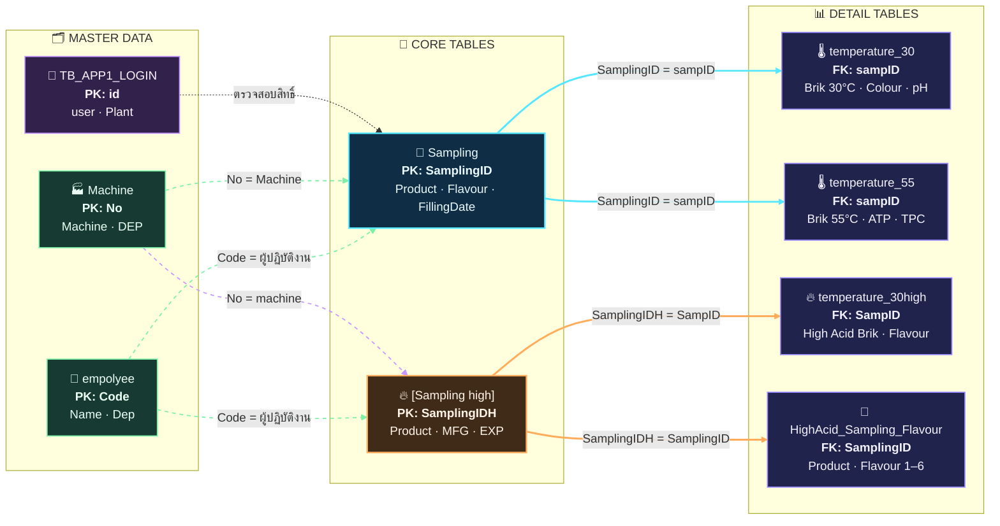

# 🧩 QSM Database Relationship Map

แผนผังแสดงความสัมพันธ์ของตารางในระบบ **QSM Microbiology Analysis System** โดยใช้ Mermaid ซึ่งสามารถแสดงผลได้บน GitHub, GitLab และ Markdown Viewer ที่รองรับ Mermaid

## 🗺️ Database Relationship Infographic

## 🔑 Key Relationship

| ตารางต้นทาง | ตารางปลายทาง | Column ที่ใช้เชื่อม | ความสัมพันธ์ |
|---|---|---|---|
| `Sampling` | `temperature_30` | `SamplingID = sampID` | Sampling 1 รายการมี Brik 30°C หลายรายการ |
| `Sampling` | `temperature_55` | `SamplingID = sampID` | Sampling 1 รายการมี Brik 55°C หลายรายการ |
| `[Sampling high]` | `temperature_30high` | `SamplingIDH = SampID` | High Acid 1 รายการมี Brik หลายรายการ |
| `[Sampling high]` | `HighAcid_Sampling_Flavour` | `SamplingIDH = SamplingID` | เก็บ Product และ Flavour ของ Sampling |
| `empolyee` | `Sampling` / `[Sampling high]` | `Code` | เชื่อมรหัสผู้ปฏิบัติงาน |
| `Machine` | `Sampling` / `[Sampling high]` | `No` | เชื่อมข้อมูลเครื่องจักร |
| `TB_APP1_LOGIN` | ระบบ Login | `user`, `password` | ตรวจสอบบัญชีผู้ใช้งาน |

## 🎨 Legend

- 🔵 **เส้นสีฟ้า:** ความสัมพันธ์ของ Sampling ปกติ / Low Acid
- 🟠 **เส้นสีส้ม:** ความสัมพันธ์ของ Sampling High Acid
- 🟢 **เส้นประสีเขียว:** ความสัมพันธ์กับข้อมูลพนักงานและเครื่องจักร
- 🟣 **เส้นประสีม่วง:** ความสัมพันธ์ของระบบ Login
- **PK:** Primary Key — คีย์หลักของตาราง
- **FK:** Foreign Key — คีย์ที่ใช้อ้างอิงไปยังตารางอื่น

## 🔄 Data Flow โดยสรุป

1. 📝 สร้างรายการใน `Sampling` หรือ `[Sampling high]`
2. 🧱 สร้างรายการ Brik ในตาราง `temperature_*`
3. 👥 เชื่อมผู้ปฏิบัติงานจาก `empolyee`
4. 🏭 เชื่อมเครื่องจักรจาก `Machine`
5. 🌡️ บันทึกผลตรวจ เช่น Colour, pH, ATP และ TPC
6. ✅ สรุปผลและอนุมัติผ่านกระบวนการ QSM/QA

> 📌 หมายเหตุ: GitHub จะแสดง Mermaid เมื่อไฟล์อยู่ใน Repository และเปิดผ่านหน้าเว็บ GitHub โดยตรง

