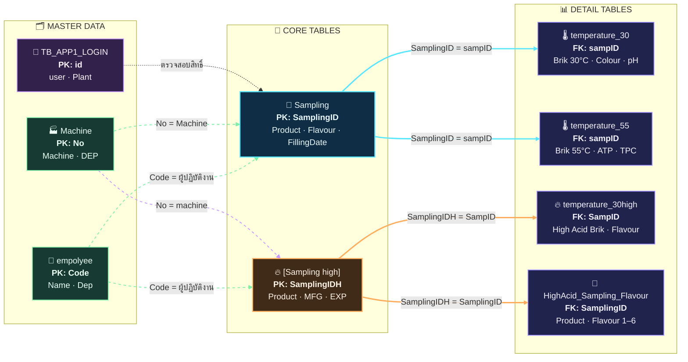

# 🧪 QSM Microbiology Analysis System — Database Design

เอกสารนี้อธิบายโครงสร้างฐานข้อมูลและ Query ของระบบ **QSM Microbiology Analysis System** โดยอ้างอิงจากไฟล์ Database Design และชุด SQL Query ที่แนบมา ใช้เป็นคู่มือสำหรับนักพัฒนา ผู้ดูแลระบบ และผู้ใช้งานที่ต้องเชื่อมต่อข้อมูลผ่าน Budibase/API

> 📌 เป้าหมายของเอกสาร: อธิบาย Table, Column, ความสัมพันธ์, Parameter และหน้าที่ของ Query แต่ละไฟล์ให้เข้าใจตรงกัน

---

## 📚 สารบัญ

- [ภาพรวมระบบ](#-ภาพรวมระบบ)
- [มาตรฐาน Parameter](#-มาตรฐาน-parameter)
- [Database Design](#-database-design)
- [คู่มือ Query รายไฟล์](#-คู่มือ-query-รายไฟล์)
- [ความสัมพันธ์ของข้อมูล](#-ความสัมพันธ์ของข้อมูล)
- [ข้อควรระวัง](#-ข้อควรระวัง)

---

## 🧭 ภาพรวมระบบ

ระบบแบ่งข้อมูลหลักออกเป็น 3 กลุ่ม:

| กลุ่ม | หน้าที่ | Table สำคัญ |
|---|---|---|
| 🥛 Production / Low Acid | จัดการ Sampling ผลิตภัณฑ์ทั่วไป | Sampling, temperature_30, temperature_55 |
| 🔥 High Acid | จัดการ Sampling ผลิตภัณฑ์ High Acid | [Sampling high], temperature_30high |
| 👥 Master Data | ข้อมูลผู้ใช้งาน เครื่องจักร และ Product/Flavour | TB_APP1_LOGIN, empolyee, Machine, HighAcid_Sampling_Flavour |

### คำศัพท์สำคัญ

| คำศัพท์ | ความหมาย |
|---|---|
| Sampling | รายการตัวอย่างที่สร้างจากผลิตภัณฑ์และการผลิตหนึ่งชุด |
| Brik | กล่อง/หน่วยตัวอย่างที่อยู่ภายใน Sampling |
| Low Acid | กระบวนการตรวจที่ใช้ตาราง Sampling ปกติ |
| High Acid | กระบวนการตรวจที่ใช้ตาราง Sampling high |
| Production | ฝ่ายผลิต ผู้ส่งตัวอย่าง และแก้ไขวันผลิต/หมดอายุ |
| QSM/QA | ผู้รับ ตรวจสอบ แปลผล และอนุมัติผลการตรวจ |

---

## 🧩 มาตรฐาน Parameter

Query ใน Budibase ใช้ตัวแปรรูปแบบ {{ Name }}:

| Parameter | ความหมาย | ตัวอย่าง |
|---|---|---|
| SamplingID / SampID | รหัส Sampling ปกติหรือ High Acid | QSM-20260815-01 |
| sampID / samp | รหัสอ้างอิงของตาราง Brik | QSM-20260815-01 |
| FillingDate | วันที่ผลิตของ Low Acid | 2026-08-15 |
| MFG / MFG_CODE | วันที่ผลิตของ High Acid | 2026-08-15 |
| EXP / EXP_CODE | วันหมดอายุ | 2027-02-15 |
| Qty | จำนวน Brik ที่ต้องการสร้าง | 6 |
| mac / machine | หมายเลขเครื่องจักร | 32 |
| locked / Locked | สถานะล็อกข้อมูลฝ่ายผลิต | 0 หรือ 1 |

> ✅ ควรตรวจสอบชนิดข้อมูลก่อนส่งค่าเข้า Query โดยเฉพาะ Date, INT, BIT และข้อความที่มีเครื่องหมายอัญประกาศ

---

## 🗄️ Database Design

### 1. TB_APP1_LOGIN 🔐

ใช้เก็บข้อมูลสำหรับเข้าสู่ระบบ

| Column | ความหมาย | การใช้งาน |
|---|---|---|
| user | ชื่อผู้ใช้งาน | ใช้ค้นหา Username |
| password | รหัสผ่าน | ใช้ตรวจสอบสิทธิ์ ควรเก็บเป็น Hash |
| fullname | ชื่อจริง-นามสกุล | แสดงชื่อผู้ใช้งาน |
| Plant | แผนก/หน่วยงาน | ใช้กำหนดสิทธิ์หรือขอบเขตข้อมูล |
| id | รหัสรายการ | Primary Key ที่แนะนำ |

### 2. Sampling 🥛

ตารางหลักของ Sampling ปกติ/Low Acid

| Column | ความหมาย | การใช้งาน |
|---|---|---|
| id | ลำดับข้อมูล | Primary Key |
| SamplingID | รหัส Sampling | Key หลักสำหรับเชื่อมตาราง Brik |
| Product | ชื่อสินค้า | ข้อมูลผลิตภัณฑ์ |
| Product_Link | Product ที่เชื่อมกับ Flavour | ใช้ค้นหา/อ้างอิง Product |
| Flavour | รสชาติ | รายละเอียดผลิตภัณฑ์ |
| Size | ขนาดผลิตภัณฑ์ | ใช้แสดงขนาดบรรจุ |
| FillingDate | วันที่ผลิต | ใช้ค้นหาและแสดงผล |
| ExpiredDate | วันหมดอายุ | ใช้ควบคุมอายุผลิตภัณฑ์ |
| Department | แผนก | แผนกที่ผลิต |
| Machine | รหัสเครื่องผลิต | เชื่อมกับ Machine.No |
| Temperature | อุณหภูมิชุดที่ 1 | ปกติคือ 30°C |
| Temperature2 | อุณหภูมิชุดที่ 2 | ปกติคือ 55°C |
| Quanity | จำนวน Brik 30°C | จำนวนตัวอย่างชุดแรก |
| Quanity2 | จำนวน Brik 55°C | จำนวนตัวอย่างชุดที่สอง |
| Plan_CheckDate / Actual_CheckDate | วันวางแผน/วันตรวจจริง 30°C | ใช้ติดตามกำหนดการ |
| Plan_CheckDate55 / Actual_CheckDate55 | วันวางแผน/วันตรวจจริง 55°C | ใช้ติดตามกำหนดการ |
| PH_Before / PH_Before2 | ค่า pH เริ่มต้น 30°C/55°C | ค่าอ้างอิงก่อนบ่ม |
| Spec_Actual / Spec_Actual2 | ค่า pH หลังตรวจ | ช่วงยอมรับ ±0.2 |
| SendBY, SendBY2, SendBY3, Send4 | รหัสผู้ส่งตัวอย่างลำดับ 1–4 | เชื่อมกับ empolyee.Code |
| Submit_By / Submit_date | ผู้ส่งให้ QA / วันที่ส่ง | เริ่มขั้นตอน QA |
| RecevieBy / Recieved_date | ผู้รับนม / วันที่รับ | รับตัวอย่าง |
| physical_by / physical_by2 | ผู้ตรวจคุณภาพกายภาพ | ผู้ตรวจแต่ละรอบ |
| physical_date / physical_date2 | วันที่ตรวจคุณภาพ | วันเวลาตรวจ |
| results_by / results_by2 | ผู้ตรวจจุลินทรีย์ | ผู้บันทึกผล |
| results_date / results_date2 | วันที่ตรวจจุลินทรีย์ | วันเวลาตรวจ |
| SupervisorBy / Supervisor_Date | ผู้อนุมัติ / วันที่อนุมัติ | ปิดกระบวนการ |
| CreatedBY / CreatedAt | ผู้สร้างหรือเวลาที่สร้าง | Audit เบื้องต้น |
| Products | สินค้าแต่ง/ข้อมูลเพิ่มเติม | รายละเอียดเพิ่มเติม |
| EditBy / UpdateAt | ผู้แก้ไข/เวลาแก้ไขล่าสุด | Audit เบื้องต้น |
| dayFinished / dayFinished2 | วันบ่ม 30°C/55°C | ใช้ติดตามระยะเวลาบ่ม |
| Amount_Samples | จำนวนกล่องทั้งหมด | จำนวนตัวอย่างรวม |
| Example, Indication, packaging | CheckBox ตรวจความครบถ้วน | ตรวจสภาพตัวอย่าง |
| complete, Detail_Complete, Normal | CheckBox สถานะปกติ/ครบถ้วน | สถานะการตรวจ |
| Incomplete, Detail_incomplete | หมายเหตุข้อมูลไม่ครบ | รายละเอียดข้อผิดพลาด |
| Abnormal | หมายเหตุความผิดปกติ | รายละเอียดผิดปกติ |
| atp, Smell, Tpc, Colour, PH | CheckBox ผลตรวจ 30°C | สถานะรายการตรวจ |
| atp2, Smell2, Tpc2, Colour2, PH2 | CheckBox ผลตรวจ 55°C | สถานะรายการตรวจ |
| production_update_uid | ผู้แก้ไข Filling Date | อ้างอิงการแก้ไขฝ่ายผลิต |
| Locked_Production | ล็อกการเพิ่ม Brik | 0 = ยังไม่ล็อก, 1 = ล็อกแล้ว |

### 3. temperature_30 และ temperature_55 🌡️

เก็บรายการ Brik และผลตรวจของ Sampling ปกติ แยกตามอุณหภูมิ

| Column | ความหมาย |
|---|---|
| id | Primary Key ของรายการ Brik |
| sampID | รหัส Sampling ที่เป็นเจ้าของ Brik |
| no | ลำดับ Brik ภายใน Sampling |
| code | เวลาเก็บกล่อง/เวลาสร้าง |
| ColourCode | ค่าหรือรหัสสี |
| Colour | CheckBox ผลตรวจสี |
| Smell | CheckBox ผลตรวจกลิ่น |
| tpc | CheckBox ผลตรวจ TPC |
| remark | หมายเหตุผลตรวจ |
| atp | ผลตรวจ ATP |
| temp | CheckBox ผลตรวจอุณหภูมิ |
| ph | ผลตรวจ pH |
| NewpH | ผล pH ที่ตรวจใหม่ |
| NewATP | ผล ATP ที่ตรวจใหม่ |
| status | สถานะของ Brik |

### 4. [Sampling high] 🔥

ตารางหลักของ Sampling High Acid

| Column | ความหมาย |
|---|---|
| SamplingIDH | รหัส Sampling High Acid |
| machine | เครื่องผลิต |
| amount | จำนวนตัวอย่าง |
| TPCH, Y_M, Physical_T | CheckBox ผลตรวจหลัก |
| Room_Temp, Temp0_8, Freezer | CheckBox เงื่อนไขอุณหภูมิ |
| OtherSpecBox / Other_Spec | ผลตรวจอื่น / หมายเหตุ |
| Submit_by / Submit_date | ผู้ส่งและวันที่ส่ง |
| received_by / received_date | ผู้รับและวันที่รับ |
| Complete / De_Complete / Packaging | สถานะความครบถ้วนและบรรจุภัณฑ์ |
| incom_spec / De_incom_spec | สถานะข้อมูลไม่ครบ |
| ab_spec | สถานะผิดปกติ |
| incom_spec_re / ab_spec_re | เหตุผลของสถานะ |
| check_date | วันที่ตรวจ โดย Design ระบุไม่นับวันผลิต +6 วัน |
| MFG_code / EXP_code | วันที่ผลิต / วันหมดอายุ |
| inspector_by / inspector_date | ผู้ตรวจ / วันที่ตรวจ |
| interpretor_by / intertor_date | ผู้แปลผล / วันที่แปลผล |
| QSM_Sup_by / QSM_Sup_date | ผู้อนุมัติ QA / วันที่อนุมัติ |

### 5. temperature_30high 🔥🌡️

| Column | ความหมาย |
|---|---|
| id | Primary Key |
| SampID | เชื่อมกับ [Sampling high].SamplingIDH |
| No | ลำดับ Brik |
| Code | เวลาเก็บหรือเวลาสร้าง Brik |
| Flavour | กลิ่น/รสชาติของผลิตภัณฑ์ |
| TPC, Y_M | CheckBox ผลตรวจจุลินทรีย์ |
| Colour, Smell, Appearance | CheckBox ผลตรวจกายภาพ |
| Remark | สถานะหรือหมายเหตุ |

### 6. HighAcid_Sampling_Flavour 🍓

| Column | ความหมาย |
|---|---|
| SamplingID | รหัส Sampling ที่อ้างอิง |
| Product / Product2 | Product ที่เลือกได้ 2 รายการ |
| Flavour ถึง Flavour6 | Flavour ที่เลือกได้สูงสุด 6 รายการ |

### 7. Qualilty_Control 🧪

| Column | ความหมาย |
|---|---|
| SampID | รหัส Sampling/Brik ที่อ้างอิง |
| No | ลำดับรายการตรวจ |
| Media | ชื่อเชื้อหรือ Media |
| Batch | ชื่อ/รหัสขวดที่ใช้งาน |
| Pass / Not Pass | CheckBox ผ่าน/ไม่ผ่าน |

### 8. Machine และ Machine_Size 🏭

| Table | Column | ความหมาย |
|---|---|---|
| Machine | ID | รหัสรายการ |
| Machine | No | หมายเลขเครื่อง |
| Machine | Machine | ชื่อเครื่องจักร |
| Machine | DEP | แผนก |
| Machine_Size | No | หมายเลขเครื่อง |
| Machine_Size | Machine | ชื่อเครื่อง |
| Machine_Size | DEP | แผนก |
| Machine_Size | size | ขนาดที่ผลิตได้ |

### 9. empolyee 👥

| Column | ความหมาย |
|---|---|
| Name | ชื่อพนักงาน |
| Dep | แผนกของพนักงาน |
| Code | รหัสพนักงาน ใช้ JOIN กับ Column ผู้ปฏิบัติงาน |

---

## 🧾 คู่มือ Query รายไฟล์

| ไฟล์ | ประเภท | หน้าที่ | Parameter หลัก |
|---|---|---|---|
| Bottom_Recall.sql | SELECT | ดึง Brik High Acid สำหรับ Recall | SamplingID |
| CallBack Sampling.sql | SELECT | ดึง Sampling ปกติพร้อมชื่อผู้ปฏิบัติงานและ Brik ล่าสุด | SamplingID |
| CallBack Sampling_HighAcid.sql | SELECT | ดึง Sampling High Acid พร้อมขั้นตอนการตรวจ | SamplingID |
| CallProduct30.sql | SELECT | ดึง Brik 30°C แรกที่ยังไม่มี Colour | sampID |
| ColorCode.sql | UPDATE | อัปเดตรหัสสีของ Sampling | code, SampID |
| Create Sampling.sql | INSERT | สร้าง Sampling ปกติ | Filldate, Expiredate, Product, Flavour, DE, MC, Size, locked, SampID |
| Create Sampling_HighAcid.sql | INSERT | สร้าง Sampling High Acid | sampID, product, size, machine, MFG, EXP |
| Create_Flavour_Sampling.sql | INSERT | บันทึก Product/Flavour High Acid | SamplingID, Product, Product2, Flavour–Flavour6 |
| DEV_DELETE.sql | DELETE | ลบ Sampling High Acid และ Brik | id |
| DEV_LOW_DELETE.sql | DELETE | ลบ Sampling ปกติและ Brik 30/55°C | id |
| Flavour options.sql | SELECT | แปลง Product/Flavour เป็นรายการ Dropdown | SampID |
| HighAcid_Genarate_No.sql | SELECT | คำนวณเลข Brik High Acid ถัดไป | sampID |
| HighAcid_InsertBrik.sql | INSERT | เพิ่ม Brik High Acid ครั้งละไม่เกิน 6 | Qty, SampID, Date, Time, Status, Product, Flavour |
| LOGIN_API.sql | SELECT | ตรวจสอบ Username และ Password | userac, psw |
| Product_Insert.sql | SELECT | คำนวณเลข Brik ถัดไปแยก 30/55°C | sampID |
| Sampling_HighAcid_Tables.sql | SELECT | แสดงและค้นหา Sampling High Acid | FillingDate, sampid, mac |
| Sampling_Table.sql | SELECT | แสดงและค้นหา Sampling ปกติ | FillingDate, sampid, mac |
| Summary.sql | SELECT | สรุปจำนวน Brik 30°C และ 55°C | samp |
| SupHighAcid_Production_Update.sql | UPDATE | แก้ไข MFG/EXP High Acid | MFG_CODE, EXP_CODE, sampID |
| Sup_Production_Update.sql | UPDATE | แก้ไขวันผลิต/หมดอายุ Sampling ปกติ | FillingDate, ExpiredDate, pdt_id, sampID |
| Temp30_Insert.sql | INSERT | เพิ่ม Brik 30°C สูงสุดครั้งละ 6 รวมไม่เกิน 100 | Qty, sampID, SampleDate, status |
| Temp55_Insert.sql | INSERT | เพิ่ม Brik 55°C สูงสุดครั้งละ 6 รวมไม่เกิน 100 | Qty, sampID, SampleDate, status |
| Update Sampling HighAcid.sql | UPDATE | อัปเดตผู้ส่งและ Lock High Acid | SendID, SendID2, SendID3, Send4, Locked, SampID |
| Update Sampling.sql | UPDATE | อัปเดตผู้ส่งและ Lock Sampling ปกติ | SendID, SendID2, SendID3, Send4, Locked, SampID |

### รายละเอียดการใช้งาน Query

#### Bottom_Recall.sql 🔎

ดึงรายการ Brik จาก temperature_30high โดยกรองด้วย SamplingID ผลลัพธ์ประกอบด้วยลำดับ Brik, Status, Flavour, Product และเวลาแบบไทย เหมาะสำหรับหน้า Recall/ตรวจสอบ

#### CallBack Sampling.sql 🔄

ดึงข้อมูล Sampling ปกติทั้งหมด พร้อม JOIN ชื่อพนักงานจาก empolyee, ชื่อเครื่องจาก Machine และดึง Brik ล่าสุด/Remark สูงสุด 3 รายการของ 30°C และ 55°C ด้วย OUTER APPLY

#### CallBack Sampling_HighAcid.sql 🔥

ดึงข้อมูล High Acid พร้อม MFG/EXP, Product/Flavour, ชื่อผู้ปฏิบัติงานแต่ละขั้นตอน, เวลาการส่ง/รับ/ตรวจ/อนุมัติ และ Brik ล่าสุดจาก temperature_30high

#### Create Sampling.sql และ Create Sampling_HighAcid.sql ➕

ใช้สร้างข้อมูลแม่ของ Sampling ก่อนสร้าง Brik โดย Low Acid จะสร้าง Product_Link อัตโนมัติ และ High Acid จะเริ่มต้น Locked_Production เป็น 0

#### Temp30_Insert.sql และ Temp55_Insert.sql 🌡️

สร้างเลข Brik ต่อจาก MAX(no) เดิม จำกัดครั้งละไม่เกิน 6 รายการ และจำกัดจำนวนรวมต่อ Sampling ไม่เกิน 100 รายการ

#### HighAcid_InsertBrik.sql 🔥

สร้าง Brik High Acid ต่อจากเลขเดิม จำกัด Qty ไม่เกิน 6 พร้อมบันทึก Product, Flavour, Status และเวลา

#### Sampling_Table.sql และ Sampling_HighAcid_Tables.sql 📊

ใช้แสดงรายการ Sampling ในหน้าตาราง รองรับการค้นหาด้วยวันที่, รหัส Sampling และเครื่องจักร หากทุก Parameter ว่าง Query จะคืนข้อมูลทั้งหมด

#### Summary.sql 📈

คืนจำนวนรายการ Brik ด้วยผลลัพธ์ count30 และ count55 เหมาะสำหรับ Dashboard

---

# 🧩 QSM Database Relationship Map

แผนผังแสดงความสัมพันธ์ของตารางในระบบ **QSM Microbiology Analysis System** โดยใช้ Mermaid ซึ่งสามารถแสดงผลได้บน GitHub, GitLab และ Markdown Viewer ที่รองรับ Mermaid

## 🗺️ Database Relationship Infographic

## 🔑 Key Relationship

| ตารางต้นทาง | ตารางปลายทาง | Column ที่ใช้เชื่อม | ความสัมพันธ์ |
|---|---|---|---|
| `Sampling` | `temperature_30` | `SamplingID = sampID` | Sampling 1 รายการมี Brik 30°C หลายรายการ |
| `Sampling` | `temperature_55` | `SamplingID = sampID` | Sampling 1 รายการมี Brik 55°C หลายรายการ |
| `[Sampling high]` | `temperature_30high` | `SamplingIDH = SampID` | High Acid 1 รายการมี Brik หลายรายการ |
| `[Sampling high]` | `HighAcid_Sampling_Flavour` | `SamplingIDH = SamplingID` | เก็บ Product และ Flavour ของ Sampling |
| `empolyee` | `Sampling` / `[Sampling high]` | `Code` | เชื่อมรหัสผู้ปฏิบัติงาน |
| `Machine` | `Sampling` / `[Sampling high]` | `No` | เชื่อมข้อมูลเครื่องจักร |
| `TB_APP1_LOGIN` | ระบบ Login | `user`, `password` | ตรวจสอบบัญชีผู้ใช้งาน |

## 🎨 Legend

- 🔵 **เส้นสีฟ้า:** ความสัมพันธ์ของ Sampling ปกติ / Low Acid
- 🟠 **เส้นสีส้ม:** ความสัมพันธ์ของ Sampling High Acid
- 🟢 **เส้นประสีเขียว:** ความสัมพันธ์กับข้อมูลพนักงานและเครื่องจักร
- 🟣 **เส้นประสีม่วง:** ความสัมพันธ์ของระบบ Login
- **PK:** Primary Key — คีย์หลักของตาราง
- **FK:** Foreign Key — คีย์ที่ใช้อ้างอิงไปยังตารางอื่น

## 🔄 Data Flow โดยสรุป

1. 📝 สร้างรายการใน `Sampling` หรือ `[Sampling high]`
2. 🧱 สร้างรายการ Brik ในตาราง `temperature_*`
3. 👥 เชื่อมผู้ปฏิบัติงานจาก `empolyee`
4. 🏭 เชื่อมเครื่องจักรจาก `Machine`
5. 🌡️ บันทึกผลตรวจ เช่น Colour, pH, ATP และ TPC
6. ✅ สรุปผลและอนุมัติผ่านกระบวนการ QSM/QA

> 📌 หมายเหตุ: GitHub จะแสดง Mermaid เมื่อไฟล์อยู่ใน Repository และเปิดผ่านหน้าเว็บ GitHub โดยตรง

## ⚠️ ข้อควรระวัง

- 🔐 LOGIN_API.sql ใช้การเปรียบเทียบ Password โดยตรง ควรเปลี่ยนเป็น Password Hash และไม่ควรใช้ SELECT *
- 🗑️ DEV_DELETE.sql และ DEV_LOW_DELETE.sql เป็น Query ลบข้อมูล ควรจำกัดสิทธิ์และใช้ Transaction
- 🔢 MAX(no)+1 อาจเกิดเลขซ้ำเมื่อมีผู้ใช้งานบันทึกพร้อมกัน ควรใช้ Transaction/Lock/Sequence
- 📅 บาง Query ใช้ DATEADD(HOUR, 7, ...) และบาง Query ใช้ค่า UTC ควรกำหนดมาตรฐานเดียวกัน
- 🧮 CallProduct30.sql ควรครอบวงเล็บเงื่อนไข AND/OR ใน checked_count เพื่อไม่ให้นับข้อมูลข้าม Sampling
- 🎨 ColorCode.sql ปัจจุบันอัปเดต ColourCode ทุก Brik ของ SampID เดียวกัน หากแก้เฉพาะรายการควรกรองด้วย id หรือ no
- 🧾 Query สำหรับ API ควรระบุ Column ที่ต้องการส่งกลับแทน SELECT *
- 🧱 ควรพิจารณาสร้าง Foreign Key ระหว่าง Sampling กับตาราง Brik
- 🧪 ควร Validate ค่าว่าง, Date ผิดรูปแบบ, Qty ติดลบ และ SamplingID ซ้ำก่อน Execute
- 📌 ใช้ชื่อ [Sampling high] ให้ตรงกันทุก Query

---

## ✅ สรุป

Database Design นี้รองรับตั้งแต่การสร้าง Sampling, สร้าง Brik, บันทึกผลตรวจ 30°C/55°C, ตรวจ High Acid, เรียกดูข้อมูล, แก้ไขโดยฝ่ายผลิต และอนุมัติโดย QSM/QA โดยมี SamplingID เป็นศูนย์กลางในการเชื่อมโยงข้อมูล

ควรปรับปรุง README ทุกครั้งที่มีการเพิ่ม Table, เปลี่ยนชื่อ Column หรือเพิ่ม Query ใหม่ เพื่อให้ Database Design และการใช้งานจริงสอดคล้องกันเสมอ

